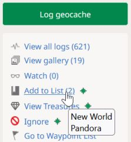
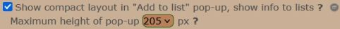
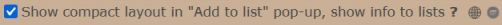
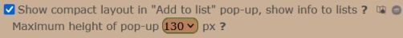
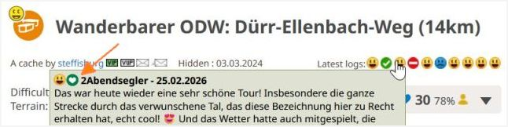

<a href="#v0181" title="GClh II version 0.18.1 (24.03.2026)">v0.18.1</a> &nbsp;
<a href="#v018" title="GClh II version 0.18 (15.03.2026)">v0.18</a> &nbsp;
<a href="#v01714" title="GClh II version 0.17.14 (16.02.2026)">v0.17.14</a> &nbsp;
<a href="#v01713" title="GClh II version 0.17.13 (08.02.2026)">v0.17.13</a> &nbsp;
<a href="#v01712" title="GClh II version 0.17.12 (22.01.2026)">v0.17.12</a> &nbsp;
<a href="#v01711" title="GClh II version 0.17.11 (11.01.2026)">v0.17.11</a> &nbsp;
<a href="#v01710" title="GClh II version 0.17.10 (21.11.2025)">v0.17.10</a> &nbsp;
<a href="#v0179" title="GClh II version 0.17.9 (29.10.2025)">v0.17.9</a> &nbsp;
<a href="#v0178" title="GClh II version 0.17.8 (20.10.2025)">v0.17.8</a> &nbsp;
<a href="#v0177" title="GClh II version 0.17.7 (04.10.2025)">v0.17.7</a> &nbsp;
<a href="#v0176" title="GClh II version 0.17.6 (16.09.2025)">v0.17.6</a> &nbsp;
<a href="#v0175" title="GClh II version 0.17.5 (26.08.2025)">v0.17.5</a> &nbsp;
<a href="#v0174" title="GClh II version 0.17.4 (14.08.2025)">v0.17.4</a> &nbsp;
<a href="#v0173" title="GClh II version 0.17.3 (11.08.2025)">v0.17.3</a> &nbsp;
<a href="#v0172" title="GClh II version 0.17.2 (31.07.2025)">v0.17.2</a> &nbsp;
<a href="#v0171" title="GClh II version 0.17.1 (20.07.2025)">v0.17.1</a> &nbsp;
<a href="#v017" title="GClh II version 0.17 (02.07.2025)">v0.17</a> &nbsp;
<a href="#v01611" title="GClh II version 0.16.11 (10.05.2025)">v0.16.11</a> &nbsp;
<a href="#v01610" title="GClh II version 0.16.10 (02.05.2025)">v0.16.10</a> &nbsp;
<a href="#v0169" title="GClh II version 0.16.9 (25.04.2025)">v0.16.9</a> &nbsp;
<a href="#v0168" title="GClh II version 0.16.8 (16.04.2025)">v0.16.8</a> &nbsp;
<a href="#v0167" title="GClh II version 0.16.7 (20.03.2025)">v0.16.7</a> &nbsp;
<a href="#v0166" title="GClh II version 0.16.6 (11.03.2025)">v0.16.6</a> &nbsp;
<a href="#v0165" title="GClh II version 0.16.5 (18.02.2025)">v0.16.5</a> &nbsp;
<a href="#v0164" title="GClh II version 0.16.4 (04.02.2025)">v0.16.4</a> &nbsp;
<a href="#v0163" title="GClh II version 0.16.3 (28.01.2025)">v0.16.3</a> &nbsp;
<a href="#v0162" title="GClh II version 0.16.2 (30.08.2024)">v0.16.2</a> &nbsp;
<a href="#v0161" title="GClh II version 0.16.1 (13.08.2024)">v0.16.1</a> &nbsp;
<a href="#v016" title="GClh II version 0.16 (13.08.2024)">v0.16</a> &nbsp;
<a href="#v0159" title="GClh II version 0.15.9 (13.06.2024)">v0.15.9</a> &nbsp;
<a href="#v0158" title="GClh II version 0.15.8 (20.04.2024)">v0.15.8</a> &nbsp;
<a href="#v0157" title="GClh II version 0.15.7 (13.04.2024)">v0.15.7</a> &nbsp;
<a href="#v0156" title="GClh II version 0.15.6 (14.03.2024)">v0.15.6</a> &nbsp;
<a href="#v0155" title="GClh II version 0.15.5 (11.01.2024)">v0.15.5</a> &nbsp;
<a href="#v0154" title="GClh II version 0.15.4 (09.01.2024)">v0.15.4</a> &nbsp;
<a href="#v0153" title="GClh II version 0.15.3 (20.12.2023)">v0.15.3</a> &nbsp;
<a href="#v0152" title="GClh II version 0.15.2 (09.12.2023)">v0.15.2</a> &nbsp;
<a href="#v0151" title="GClh II version 0.15.1 (02.12.2023)">v0.15.1</a> &nbsp;
<a href="#v015" title="GClh II version 0.15 (26.11.2023)">v0.15</a> &nbsp;
<a href="changelog_before.md" title="Go to earlier changelog">Earlier changelog</a> &nbsp;

---
## v0.18.1:
&nbsp; &nbsp;  
<ul>
	<li>
		<strong>Note:</strong> [Maps] OpenStreetMap blocked [<a href="https://github.com/2Abendsegler/GClh/issues/3032" title="Issue 3032">3032</a> / <a href="https://www.geocaching.com/profile/?u=2Abendsegler" title="Thanks to 2Abendsegler">2Abendsegler</a>]  
		The access to OpenStreetMap with map layer "OpenStreetMap Default" is sometimes blocked. We can't fix this problem. Anyone using this map layer is affected. 
		Here's the [background information in English](https://wiki.openstreetmap.org/wiki/Blocked_tiles) and [in German](https://wiki.openstreetmap.org/wiki/DE:Blocked_tiles). 
		For now, you can use the "OpenStreetMap German Style" map layer. It also works in other countries. It's similar to the "OpenStreetMap Default" map layer. However, we can't say whether this will remain the case.  
		Here you can change the deafult map layer: 
		<a href="https://www.geocaching.com/my/#GClhShowConfig#a#settings_maplayers_unavailable" title="Link to your GClh II Config">Settings -> Map - Layers in Map - Default map layer</a> 
		<a href="https://www.geocaching.com/my/#GClhShowConfig#a#settings_map_overview_build" title="Link to your GClh II Config">Settings -> Listing - Overview Map - Map layer</a>  
	</li>
	<li>
		<strong>New:</strong> [Cache Listing, Maps] Update "Add to List" info when new list has been added. [<a href="https://github.com/2Abendsegler/GClh/issues/3046" title="Issue 3046">3046</a> / <a href="https://www.geocaching.com/profile/?u=2Abendsegler" title="Thanks to 2Abendsegler">2Abendsegler</a>]  
		The following three options makes the "Add to list" pop-up in Cache Listing or in the Browse Map or in the Search Map more compact and displays information about the lists that contain the cache. The information about the lists is updated immediately as soon as a new list is added. 
		For example in Cache Listing: 
		 
		For further examples see issue.  
		Not all the parameters are new. However, the features have been completely revised and expanded. 
		<a href="https://www.geocaching.com/my/#GClhShowConfig#a#settings_improve_add_to_list" title="Link to your GClh II Config">Settings -> Listing - Cache Detail Navigation: 
		</a> 
		<a href="https://www.geocaching.com/my/#GClhShowConfig#a#settings_browsemap_improve_add_to_list" title="Link to your GClh II Config">Settings -> Map (Browse Map): 
		</a> 
		<a href="https://www.geocaching.com/my/#GClhShowConfig#a#settings_searchmap_improve_add_to_list" title="Link to your GClh II Config">Settings -> Map (Search Map): 
		</a> 
		If you want to optimize the settings, you may need to change something.  
	</li>
	<li>
		<strong>New:</strong> [Cache Listing, Maps] Integrate favorite icon of log in "Latest Logs" and "VIP-List". [<a href="https://github.com/2Abendsegler/GClh/issues/3050" title="Issue 3050">3050</a> / <a href="https://www.geocaching.com/profile/?u=2Abendsegler" title="Thanks to 2Abendsegler">2Abendsegler</a>]  
		Integrate favorite icon of a log in the display of "Latest Logs" logs and "VIP-List" logs in Cache Listing. 
		Integrate favorite icon of a log in the display of "Latest Logs" logs in Browse Map and Search Map. 
		For example in Cache Listing Latest logs: 
		 
		For further examples see issue.  
	</li>
	<li>
		<strong>New:</strong> [Browse Map] Remove foreign layers from GC or other to reduce load and flicker and load faster. [<a href="https://github.com/2Abendsegler/GClh/issues/3052" title="Issue 3052">3052</a> / <a href="https://www.geocaching.com/profile/?u=2Abendsegler" title="Thanks to 2Abendsegler">2Abendsegler</a>]  
	</li>
	<li>
		<strong>Fix:</strong> [Browse Map] Hide header doesn't work. [<a href="https://github.com/2Abendsegler/GClh/issues/3025" title="Issue 3025">3025</a> / <a href="https://www.geocaching.com/profile/?u=2Abendsegler" title="Thanks to 2Abendsegler">2Abendsegler</a>] 
	</li>
	<li>
		<strong>Fix:</strong> [Browse Map] Misaligned search field in header. [<a href="https://github.com/2Abendsegler/GClh/issues/3027" title="Issue 3027">3027</a> / <a href="https://www.geocaching.com/profile/?u=Die Batzen" title="Thanks to Die Batzen">Die Batzen</a>] 
	</li>
	<li>
		<strong>Fix:</strong> [Config] Wrong parameter in config standard file. [<a href="https://github.com/2Abendsegler/GClh/issues/3028" title="Issue 3028">3028</a> / <a href="https://www.geocaching.com/profile/?u=2Abendsegler" title="Thanks to 2Abendsegler">2Abendsegler</a>] 
	</li>
	<li>
		<strong>Fix:</strong> [Config] Improve Config Link to GitHub FAQ. [<a href="https://github.com/2Abendsegler/GClh/issues/3029" title="Issue 3029">3029</a> / <a href="https://www.geocaching.com/profile/?u=2Abendsegler" title="Thanks to 2Abendsegler">2Abendsegler</a>] 
	</li>
	<li>
		<strong>Fix:</strong> [Edit Log, View Log] GClh header missing - Wait for header and build up header: Timeout detecting header. [<a href="https://github.com/2Abendsegler/GClh/issues/3030" title="Issue 3030">3030</a> / <a href="https://www.geocaching.com/profile/?u=Die Batzen" title="Thanks to Die Batzen">Die Batzen</a> / <a href="https://www.geocaching.com/profile/?u=2Abendsegler" title="Thanks to 2Abendsegler">2Abendsegler</a>] 
	</li>
	<li>
		<strong>Fix:</strong> [Log Form, Edit Log] Warning message due to unsaved changes is not displayed correctly. [<a href="https://github.com/2Abendsegler/GClh/issues/3034" title="Issue 3034">3034</a> / <a href="https://www.geocaching.com/profile/?u=2Abendsegler" title="Thanks to 2Abendsegler">2Abendsegler</a>] 
	</li>
	<li>
		<strong>Fix:</strong> [Edit Log, View Log] Improve multipage observer call. [<a href="https://github.com/2Abendsegler/GClh/issues/3035" title="Issue 3035">3035</a> / <a href="https://www.geocaching.com/profile/?u=2Abendsegler" title="Thanks to 2Abendsegler">2Abendsegler</a>] 
	</li>
	<li>
		<strong>Fix:</strong> [Browse Map] Improve Add to List feature with cache check. [<a href="https://github.com/2Abendsegler/GClh/issues/3036" title="Issue 3036">3036</a> / <a href="https://www.geocaching.com/profile/?u=2Abendsegler" title="Thanks to 2Abendsegler">2Abendsegler</a>] 
	</li>
	<li>
		<strong>Fix:</strong> [Global] Header search field too narrow on some pages. [<a href="https://github.com/2Abendsegler/GClh/issues/3037" title="Issue 3037">3037</a> / <a href="https://www.geocaching.com/profile/?u=Die Batzen" title="Thanks to Die Batzen">Die Batzen</a>] 
	</li>
	<li>
		<strong>Fix:</strong> [Global] Fix separator in horizontal header layout. [<a href="https://github.com/2Abendsegler/GClh/issues/3038" title="Issue 3038">3038</a> / <a href="https://www.geocaching.com/profile/?u=Die Batzen" title="Thanks to Die Batzen">Die Batzen</a>] 
	</li>
	<li>
		<strong>Fix:</strong> [Search Map] Prevent gray area at the bottom of the page. [<a href="https://github.com/2Abendsegler/GClh/issues/3041" title="Issue 3041">3041</a> / <a href="https://www.geocaching.com/profile/?u=Die Batzen" title="Thanks to Die Batzen">Die Batzen</a>] 
	</li>
	<li>
		<strong>Fix:</strong> [Cache Listing, Config] No longer displayed correctly. [<a href="https://github.com/2Abendsegler/GClh/issues/3042" title="Issue 3042">3042</a> / <a href="https://www.geocaching.com/profile/?u=Die Batzen" title="Thanks to Die Batzen">Die Batzen</a>] 
	</li>
	<li>
		<strong>Fix:</strong> [Cache Listing, Maps] Prevent overflows in preformatted text. [<a href="https://github.com/2Abendsegler/GClh/issues/3043" title="Issue 3043">3043</a> / <a href="https://www.geocaching.com/profile/?u=2Abendsegler" title="Thanks to 2Abendsegler">2Abendsegler</a>] 
	</li>
	<li>
		<strong>Fix:</strong> [Cache Listing] Highlight user changed coordinates doesn't work. [<a href="https://github.com/2Abendsegler/GClh/issues/3045" title="Issue 3045">3045</a> / <a href="https://www.geocaching.com/profile/?u=2Abendsegler" title="Thanks to 2Abendsegler">2Abendsegler</a>] 
	</li>
	<li>
		<strong>Fix:</strong> [My Lists] The "more" pop-up is not fully visible due to the header. [<a href="https://github.com/2Abendsegler/GClh/issues/3048" title="Issue 3048">3048</a> / <a href="https://www.geocaching.com/profile/?u=2Abendsegler" title="Thanks to 2Abendsegler">2Abendsegler</a>] 
	</li>
	<li>
		<strong>Fix:</strong> [Browse Map] Improve the first scale line of the output on the left side. [<a href="https://github.com/2Abendsegler/GClh/issues/3049" title="Issue 3049">3049</a> / <a href="https://www.geocaching.com/profile/?u=2Abendsegler" title="Thanks to 2Abendsegler">2Abendsegler</a>] 
	</li>
	<li>
		<strong>Fix:</strong> [Own Public Profile] Config does not open on about tab. [<a href="https://github.com/2Abendsegler/GClh/issues/3051" title="Issue 3051">3051</a> / <a href="https://www.geocaching.com/profile/?u=Die Batzen" title="Thanks to Die Batzen">Die Batzen</a>] 
	</li>
</ul>
 
(24.03.2026) 
released by <a href="https://www.geocaching.com/profile/?u=2Abendsegler">2Abendsegler</a> 
 

---
## v0.18:
&nbsp; &nbsp;  

### Pocket Query:
<ul>
	<li>
		<strong>New:</strong> [Pocket Query] Download generated PQs with one click to the default download location. [<a href="https://github.com/2Abendsegler/GClh/issues/2866" title="Issue 2866">2866</a> / <a href="https://www.geocaching.com/profile/?u=2Abendsegler" title="Thanks to 2Abendsegler">2Abendsegler</a>] 
		Generated Pocket Queries can be automatically downloaded via a download button. The files are saved automatically and without dialog in the browser's default download location. They are saved in zip format. 
		Further information on Pocket Query downloads and what to consider in the browser and script manager can be found <a href="../docu/faq.md#11-en" title="Link to 'FAQ 11. Information about Pocket Query Downloads.'">here</a>.  
		  
		Several placeholders are available for generating the filenames. 
		 
		<a href="https://www.geocaching.com/my/#GClhShowConfig#a#settings_download_pqs" title="Link to your GClh II Config">Settings -> Pocket Query - List of Pocket Queries: 
		</a> 
		If you want to use this feature, you may need to do some customization.  
	</li>
	<li>
		<strong>Fix:</strong> [Pocket Query] Prevent map error after PQ deletion. [<a href="https://github.com/2Abendsegler/GClh/issues/2998" title="Issue 2998">2998</a> / <a href="https://www.geocaching.com/profile/?u=Die Batzen" title="Thanks to Die Batzen">Die Batzen</a>]  
	</li>
</ul>

### Listing:
<ul>
	<li>
		<strong>New:</strong> [Cache Listing] Personal cache note templates. [<a href="https://github.com/2Abendsegler/GClh/issues/2705" title="Issue 2705">2705</a> / <a href="https://www.geocaching.com/profile/?u=2Abendsegler" title="Thanks to 2Abendsegler">2Abendsegler</a>] 
		Templates are predefined texts. You can save up to ten templates. All of your templates will be displayed under the personal caches note in listings. With a click it will be placed in the personal caches note.  
		  
		 You can also use placeholders for variables that will be replaced in the personal caches note. 
		 
		<a href="https://www.geocaching.com/my/#GClhShowConfig#a#settings_add_cache_note_templates" title="Link to your GClh II Config">Settings -> Listing - Personal Cache Note: 
		</a> 
		If you want to use this feature, you may need to do some customization.  
	</li>
	<li>
		<strong>New:</strong> [Event Listing] Set default calendar in an event listing. [<a href="https://github.com/2Abendsegler/GClh/issues/2850" title="Issue 2850">2850</a> / <a href="https://www.geocaching.com/profile/?u=2Abendsegler" title="Thanks to 2Abendsegler">2Abendsegler</a>] 
		With this option you can set the default calendar for an event listing. A selection in the calendar popup in the event listing is no longer necessary.  
		  
		<a href="https://www.geocaching.com/my/#GClhShowConfig#a#settings_set_default_calendar_link_for_event" title="Link to your GClh II Config">Settings -> Listing - Listing Header: 
		</a> 
		If you want to use this feature, you have to activate it.  
	</li>
	<li>
		<strong>New:</strong> [Cache Listing] Hide pop-up with notification about a collected treasure. [<a href="https://github.com/2Abendsegler/GClh/issues/3004" title="Issue 3004">3004</a> / <a href="https://www.geocaching.com/profile/?u=2Abendsegler" title="Thanks to 2Abendsegler">2Abendsegler</a>] 
		After logging a find, you are redirected to the cache listing, where a pop-up with a notification about a collected treasure may appear. This option prevents this pop-up from being displayed.  
		  
		<a href="https://www.geocaching.com/my/#GClhShowConfig#a#settings_hide_treasure_success_messages" title="Link to your GClh II Config">Settings -> Listing - Listing Header: 
		</a> 
		If you want to use this feature, you have to activate it.  
	</li>
	<li>
		<strong>Fix:</strong> [Cache Listing] Add to list feature no longer works properly. [<a href="https://github.com/2Abendsegler/GClh/issues/3016" title="Issue 3016">3016</a> / <a href="https://www.geocaching.com/profile/?u=2Abendsegler" title="Thanks to 2Abendsegler">2Abendsegler</a>] 
	</li>
	<li>
		<strong>Fix:</strong> [Cache Listing] One click ignoring/restoring feature no longer works properly. [<a href="https://github.com/2Abendsegler/GClh/issues/3011" title="Issue 3011">3011</a> / <a href="https://www.geocaching.com/profile/?u=2Abendsegler" title="Thanks to 2Abendsegler">2Abendsegler</a>] 
	</li>
	<li>
		<strong>Fix:</strong> [Cache Listing] Page width of exceeds readable area. [<a href="https://github.com/2Abendsegler/GClh/issues/2979" title="Issue 2979">2979</a> / <a href="https://www.geocaching.com/profile/?u=2Abendsegler" title="Thanks to 2Abendsegler">2Abendsegler</a>] 
	</li>
	<li>
		<strong>Fix:</strong> [Cache Listing] Improve screen "Enter solved coordinates" again. [<a href="https://github.com/2Abendsegler/GClh/issues/3017" title="Issue 3017">3017</a> / <a href="https://www.geocaching.com/profile/?u=2Abendsegler" title="Thanks to 2Abendsegler">2Abendsegler</a>]  
	</li>
</ul>

### Dashboard:
<ul>
	<li>
		<strong>New:</strong> [New Dashboard] Option to disable all features for dashboard. [<a href="https://github.com/2Abendsegler/GClh/issues/2982" title="Issue 2982">2982</a> / <a href="https://www.geocaching.com/profile/?u=2Abendsegler" title="Thanks to 2Abendsegler">2Abendsegler</a>] 
		This option allows you to quickly and easily disable all GC little helper II dashboard features without much effort. This is only useful if the dashboard website changes conflict with the features of GC little helper II. 
		<a href="https://www.geocaching.com/my/#GClhShowConfig#a#settings_dashboard_disable_all_features" title="Link to your GClh II Config">Settings -> Dashboard: 
		</a> 
		If you want to use this feature, you have to activate it.  
	</li>
	<li>
		<strong>New:</strong> [New Dashboard, Config] Reorganizing the dashboard configuration. [<a href="https://github.com/2Abendsegler/GClh/issues/2970" title="Issue 2970">2970</a> / <a href="https://www.geocaching.com/profile/?u=2Abendsegler" title="Thanks to 2Abendsegler">2Abendsegler</a>] 
		The dashboard configuration has been rewritten. The parameters for the old dashboard have been removed. 
		<a href="https://www.geocaching.com/my/#GClhShowConfig#a#gclh_config_db" title="Link to your GClh II Config">Settings -> Dashboard: 
		</a>  
	</li>
	<li>
		<strong>New:</strong> [New Dashboard] Split Search and Browse Map quick links. [<a href="https://github.com/2Abendsegler/GClh/issues/2989" title="Issue 2989">2989</a> / <a href="https://www.geocaching.com/profile/?u=Die Batzen" title="Thanks to Die Batzen">Die Batzen</a>] 
		Split the single config parameter to show "Search" and "Browse Map" as quick links into two separate parameters and migrate the settings from the old to the new parameters. 
		<a href="https://www.geocaching.com/my/#GClhShowConfig#a#settings_dashboard_show_search" title="Link to your GClh II Config">Settings -> Dashboard: 
		</a> 
		If you want to use this feature, you may need to activate it.  
	</li>
	<li>
		<strong>Remove:</strong> [Old Dashboard] Remove the code from the old dashboard. [<a href="https://github.com/2Abendsegler/GClh/issues/2971" title="Issue 2971">2971</a> / <a href="https://www.geocaching.com/profile/?u=2Abendsegler" title="Thanks to 2Abendsegler">2Abendsegler</a>] 
	</li>
	<li>
		<strong>Fix:</strong> [New Dashboard] Some features don't work because of new dashboard release. [<a href="https://github.com/2Abendsegler/GClh/issues/2981" title="Issue 2981">2981</a> / <a href="https://www.geocaching.com/profile/?u=2Abendsegler" title="Thanks to 2Abendsegler">2Abendsegler</a>] 
	</li>
	<li>
		<strong>Fix:</strong> [New Dashboard] Some features don't work because of new dashboard release (12.03.2026). [<a href="https://github.com/2Abendsegler/GClh/issues/3014" title="Issue 3014">3014</a> / <a href="https://www.geocaching.com/profile/?u=2Abendsegler" title="Thanks to 2Abendsegler">2Abendsegler</a>] 
	</li>
	<li>
		<strong>Fix:</strong> [New Dashboard] Option to hide/show the right sidebar no longer works. [<a href="https://github.com/2Abendsegler/GClh/issues/2972" title="Issue 2972">2972</a> / <a href="https://www.geocaching.com/profile/?u=Die Batzen" title="Thanks to Die Batzen">Die Batzen</a>] 
	</li>
	<li>
		<strong>Fix:</strong> [New Dashboard] Stop the expand icons in VIP, VUP lists from flickering. [<a href="https://github.com/2Abendsegler/GClh/issues/2996" title="Issue 2996">2996</a> / <a href="https://www.geocaching.com/profile/?u=2Abendsegler" title="Thanks to 2Abendsegler">2Abendsegler</a>] 
	</li>
	<li>
		<strong>Fix:</strong> [New Dashboard] Hide of individual rows in the left column doesn't work on very small screens. [<a href="https://github.com/2Abendsegler/GClh/issues/2975" title="Issue 2975">2975</a> / <a href="https://www.geocaching.com/profile/?u=2Abendsegler" title="Thanks to 2Abendsegler">2Abendsegler</a>]  
	</li>
</ul>

### Others:
<ul>
	<li>
		<strong>New:</strong> [Search Trackables] Extension of feature to dim lost trackables for owned trackables view to search trackables view. [<a href="https://github.com/2Abendsegler/GClh/issues/2977" title="Issue 2977">2977</a> / <a href="https://www.geocaching.com/profile/?u=2Abendsegler" title="Thanks to 2Abendsegler">2Abendsegler</a>]  
		  
		<a href="https://www.geocaching.com/my/#GClhShowConfig#a#settings_dim_lost_trackables" title="Link to your GClh II Config">Settings -> Others: 
		</a> 
		This parameter is not new. If you want to use this feature, maybe you have to activate it.  
	</li>
	<li>
		<strong>New:</strong> [Global] Add "Treasures" as a link to the Linklist. [<a href="https://github.com/2Abendsegler/GClh/issues/3006" title="Issue 3006">3006</a> / <a href="https://www.geocaching.com/profile/?u=2Abendsegler" title="Thanks to 2Abendsegler">2Abendsegler</a>]  
	</li>
	<li>
		<strong>Fix:</strong> [Search Map] Matrix links from difficulty and terrain statistics grid are not working as expected. [<a href="https://github.com/2Abendsegler/GClh/issues/2973" title="Issue 2973">2973</a> / <a href="https://www.geocaching.com/profile/?u=Die Batzen" title="Thanks to Die Batzen">Die Batzen</a>] 
	</li>
	<li>
		<strong>Fix:</strong> [Maps] Add to list feature no longer works properly. [<a href="https://github.com/2Abendsegler/GClh/issues/3016" title="Issue 3016">3016</a> / <a href="https://www.geocaching.com/profile/?u=2Abendsegler" title="Thanks to 2Abendsegler">2Abendsegler</a>] 
	</li>
	<li>
		<strong>Fix:</strong> [Global] Misaligned header content in the horizontal menu. [<a href="https://github.com/2Abendsegler/GClh/issues/3009" title="Issue 3009">3009</a> / <a href="https://www.geocaching.com/profile/?u=Die Batzen" title="Thanks to Die Batzen">Die Batzen</a> / <a href="https://www.geocaching.com/profile/?u=2Abendsegler" title="Thanks to 2Abendsegler">2Abendsegler</a>] 
	</li>
	<li>
		<strong>Fix:</strong> [Global] GClh header is built with a delay, improve header handling. [<a href="https://github.com/2Abendsegler/GClh/issues/2993" title="Issue 2993">2993</a> / <a href="https://www.geocaching.com/profile/?u=Die Batzen" title="Thanks to Die Batzen">Die Batzen</a>] 
	</li>
	<li>
		<strong>Fix:</strong> [Global] Prevent user menu from disappearing behind page elements. [<a href="https://github.com/2Abendsegler/GClh/issues/2992" title="Issue 2992">2992</a> / <a href="https://www.geocaching.com/profile/?u=Die Batzen" title="Thanks to Die Batzen">Die Batzen</a>] 
	</li>
	<li>
		<strong>Fix:</strong> [Config] Improve table alignment for "Show custom links in sidebar". [<a href="https://github.com/2Abendsegler/GClh/issues/2995" title="Issue 2995">2995</a> / <a href="https://www.geocaching.com/profile/?u=2Abendsegler" title="Thanks to 2Abendsegler">2Abendsegler</a>] 
	</li>
	<li>
		<strong>Fix:</strong> [Profile] "Use old links to finds and hides caches" no longer works for the links in the cache types. [<a href="https://github.com/2Abendsegler/GClh/issues/2991" title="Issue 2991">2991</a> / <a href="https://www.geocaching.com/profile/?u=2Abendsegler" title="Thanks to 2Abendsegler">2Abendsegler</a>] 
	</li>
	<li>
		<strong>Fix:</strong> [Profile] Count of trackables is splitting. [<a href="https://github.com/2Abendsegler/GClh/issues/2976" title="Issue 2976">2976</a> / <a href="https://www.geocaching.com/profile/?u=2Abendsegler" title="Thanks to 2Abendsegler">2Abendsegler</a>] 
	</li>
</ul>
 
(15.03.2026) 
released by <a href="https://www.geocaching.com/profile/?u=2Abendsegler">2Abendsegler</a> 
 

---
## v0.17.14:
&nbsp; &nbsp;  
<ul>
	<li>
		<strong>New:</strong> [New Dashboard] Show menu under the header as in the old dashboard. [<a href="https://github.com/2Abendsegler/GClh/issues/2953" title="Issue 2953">2953</a> / <a href="https://www.geocaching.com/profile/?u=2Abendsegler" title="Thanks to 2Abendsegler">2Abendsegler</a>] 
		This option allows you to show a menu below the header, similar to what you know from the old dashboard. 
		 
		<a href="https://www.geocaching.com/my/#GClhShowConfig#a#settings_dashboard_build_menu_old_db_in_new_db" title="Link to your GClh II Config">Settings -> Dashboard: 
		</a> 
		If you want to use this feature, you have to activate it.  
	</li>
	<li>
		<strong>New:</strong> [New Dashboard] Option to hide/show the right sidebar. [<a href="https://github.com/2Abendsegler/GClh/issues/2950" title="Issue 2950">2950</a> / <a href="https://www.geocaching.com/profile/?u=Die Batzen" title="Thanks to Die Batzen">Die Batzen</a>] 
		 
		This following option allows you to hide the sidebar on the far right by default. This hides, for example, “Events nearby”, “Geocaches nearby”, “Unpublished Hides”. 
		<a href="https://www.geocaching.com/my/#GClhShowConfig#a#settings_dashboard_hide_right_sidebar" title="Link to your GClh II Config">Settings -> Dashboard: 
		</a> 
		If you want to use this feature, you have to activate it.  
	</li>
	<li>
		<strong>New:</strong> [New Dashboard] Unpublished event dates follow user setting. [<a href="https://github.com/2Abendsegler/GClh/issues/2962" title="Issue 2962">2962</a> / <a href="https://www.geocaching.com/profile/?u=Die Batzen" title="Thanks to Die Batzen">Die Batzen</a>] 
		Dates of unpublished events now follow the date format of own user setting.  
	</li>
	<li>
		<strong>New:</strong> [New Dashboard] Improve and fix sorting of unpublished caches. [<a href="https://github.com/2Abendsegler/GClh/issues/2959" title="Issue 2959">2959</a> / <a href="https://www.geocaching.com/profile/?u=Die Batzen" title="Thanks to Die Batzen">Die Batzen</a>] 
		An alphabetical sorting now also considers numbers in cache names and a sorting by GC code now works properly.  
	</li>
	<li>
		<strong>New:</strong> [New Dashboard] Integrate additional external rows like "send2cgeo" into the hiding of individual rows in the left column of your dashboard. [<a href="https://github.com/2Abendsegler/GClh/issues/2949" title="Issue 2949">2949</a> / <a href="https://www.geocaching.com/profile/?u=2Abendsegler" title="Thanks to 2Abendsegler">2Abendsegler</a>]  
	</li>
	<li>
		<strong>Fix:</strong> [New Dashboard] Unpublished hides are missing. [<a href="https://github.com/2Abendsegler/GClh/issues/2952" title="Issue 2952">2952</a> / <a href="https://www.geocaching.com/profile/?u=Die Batzen" title="Thanks to Die Batzen">Die Batzen</a>] 
	</li>
	<li>
		<strong>Fix:</strong> [New Dashboard] Fix border for unpublished events. [<a href="https://github.com/2Abendsegler/GClh/issues/2961" title="Issue 2961">2961</a> / <a href="https://www.geocaching.com/profile/?u=Die Batzen" title="Thanks to Die Batzen">Die Batzen</a>] 
	</li>
	<li>
		<strong>Fix:</strong> [Search Map] Wrong position of button "Display Options". [<a href="https://github.com/2Abendsegler/GClh/issues/2963" title="Issue 2963">2963</a> / <a href="https://www.geocaching.com/profile/?u=Die Batzen" title="Thanks to Die Batzen">Die Batzen</a>] 
	</li>
	<li>
		<strong>Fix:</strong> [New Log Form] Word count not correct when using special characters. [<a href="https://github.com/2Abendsegler/GClh/issues/2957" title="Issue 2957">2957</a> / <a href="https://www.geocaching.com/profile/?u=2Abendsegler" title="Thanks to 2Abendsegler">2Abendsegler</a> / <a href="https://www.geocaching.com/profile/?u=Die Batzen" title="Thanks to Die Batzen">Die Batzen</a>] 
	</li>
</ul>
 
(16.02.2026) 
released by <a href="https://www.geocaching.com/profile/?u=2Abendsegler">2Abendsegler</a> 
 

---
## v0.17.13:
&nbsp; &nbsp;  
<ul>
	<li>
		<strong>New:</strong> [New Dashboard] Extending of the hide of individual rows in the left column of your dashboard. [<a href="https://github.com/2Abendsegler/GClh/issues/2939" title="Issue 2939">2939</a> / <a href="https://www.geocaching.com/profile/?u=2Abendsegler" title="Thanks to 2Abendsegler">2Abendsegler</a>] 
		This feature allows you to hide individual rows in the complete left column of your dashboard. Each row has an icon for marking it. Above all rows, there's another icon for activating the configuration. 
		 
		<a href="https://www.geocaching.com/my/#GClhShowConfig#a#settings_row_hide_new_dashboard" title="Link to your GClh II Config">Settings -> Dashboard: 
		</a> 
		If you want to use this feature, you may need to activate it.  
	</li>
	<li>
		<strong>Fix:</strong> [New Dashboard] Some features in left navigation sidebar don't work because of new dashboard release, again. [<a href="https://github.com/2Abendsegler/GClh/issues/2934" title="Issue 2934">2934</a> / <a href="https://www.geocaching.com/profile/?u=2Abendsegler" title="Thanks to 2Abendsegler">2Abendsegler</a>] 
	</li>
	<li>
		<strong>Fix:</strong> [Global] Draft indicator in header no longer works. [<a href="https://github.com/2Abendsegler/GClh/issues/2935" title="Issue 2935">2935</a> / <a href="https://www.geocaching.com/profile/?u=2Abendsegler" title="Thanks to 2Abendsegler">2Abendsegler</a>] 
	</li>
	<li>
		<strong>Fix:</strong> [Global] The order of the links in the Play Menu has changed. [<a href="https://github.com/2Abendsegler/GClh/issues/2942" title="Issue 2942">2942</a> / <a href="https://www.geocaching.com/profile/?u=2Abendsegler" title="Thanks to 2Abendsegler">2Abendsegler</a>] 
	</li>
	<li>
		<strong>Fix:</strong> [Cache Listing] Upvote buttons "Great story" and "Helpful" in logs are no longer available for basic members. [<a href="https://github.com/2Abendsegler/GClh/issues/2943" title="Issue 2943">2943</a> / <a href="https://www.geocaching.com/profile/?u=2Abendsegler" title="Thanks to 2Abendsegler">2Abendsegler</a>] 
	</li>
	<li>
		<strong>Fix:</strong> [Cache Listing] Different spacing of the buttons at the bottom of the logs. [<a href="https://github.com/2Abendsegler/GClh/issues/2944" title="Issue 2944">2944</a> / <a href="https://www.geocaching.com/profile/?u=2Abendsegler" title="Thanks to 2Abendsegler">2Abendsegler</a>] 
	</li>
</ul>
 
(08.02.2026) 
released by <a href="https://www.geocaching.com/profile/?u=2Abendsegler">2Abendsegler</a> 
 

---
## v0.17.12:
&nbsp; &nbsp;  
<ul>
	<li>
		<strong>Fix:</strong> [New Dashboard] Some features in left navigation sidebar don't work because of new dashboard release. [<a href="https://github.com/2Abendsegler/GClh/issues/2928" title="Issue 2928">2928</a> / <a href="https://www.geocaching.com/profile/?u=2Abendsegler" title="Thanks to 2Abendsegler">2Abendsegler</a>] 
	</li>
	<li>
		<strong>Fix:</strong> [PQ-Splitter] PQ creation not working after redesign of Project-GC website. [<a href="https://github.com/2Abendsegler/GClh/issues/2867" title="Issue 2867">2867</a> / <a href="https://www.geocaching.com/profile/?u=2Abendsegler" title="Thanks to 2Abendsegler">2Abendsegler</a>] 
	</li>
</ul>
 
(22.01.2026) 
released by <a href="https://www.geocaching.com/profile/?u=2Abendsegler">2Abendsegler</a> 
 

---
## v0.17.11:
&nbsp; &nbsp;  
<ul>
	<li>
		<strong>New:</strong> [Cache Listing] Add Bikerouter routing service link. [<a href="https://github.com/2Abendsegler/GClh/issues/2922" title="Issue 2922">2922</a> / <a href="https://www.geocaching.com/profile/?u=Die Batzen" title="Thanks to Die Batzen">Die Batzen</a>] 
		 
		<a href="https://www.geocaching.com/my/#GClhShowConfig#a#settings_show_bikerouter_link" title="Link to your GClh II Config">Settings -> Listing - Cache Detail Navigation: 
		</a>  
	</li>
	<li>
		<strong>New:</strong> [Cache Listing] Optimize waypoint order for routing services. [<a href="https://github.com/2Abendsegler/GClh/issues/2923" title="Issue 2923">2923</a> / <a href="https://www.geocaching.com/profile/?u=Die Batzen" title="Thanks to Die Batzen">Die Batzen</a>]  
	</li>
	<li>
		<strong>New:</strong> [Cache Listing] Option to hide "View Treasures" link. [<a href="https://github.com/2Abendsegler/GClh/issues/2917" title="Issue 2917">2917</a> / <a href="https://www.geocaching.com/profile/?u=Die Batzen" title="Thanks to Die Batzen">Die Batzen</a>] 
		 
		<a href="https://www.geocaching.com/my/#GClhShowConfig#a#settings_hide_view_treasures_link" title="Link to your GClh II Config">Settings -> Listing - Cache Detail Navigation: 
		</a> 
		If you want to use this feature, you have to activate it.  
	</li>
	<li>
		<strong>New:</strong> [Own Trackables] Option to dim lost trackables in owned trackables view. [<a href="https://github.com/2Abendsegler/GClh/issues/2844" title="Issue 2844">2844</a> / <a href="https://www.geocaching.com/profile/?u=Die Batzen" title="Thanks to Die Batzen">Die Batzen</a>] 
		Lost trackables in owned trackables view can be visually dimmed so they are easier to distinguish from active trackables. 
		 
		<a href="https://www.geocaching.com/my/#GClhShowConfig#a#settings_dim_lost_trackables" title="Link to your GClh II Config">Settings -> Others: 
		</a> 
		If you want to use this feature, you have to activate it. 
	</li>
</ul>
 
(11.01.2026) 
released by <a href="https://www.geocaching.com/profile/?u=2Abendsegler">2Abendsegler</a> 
 

---
## v0.17.10:
&nbsp; &nbsp;  
<ul>
	<li>
		<strong>Fix:</strong> [Search Map] Malfunction of map features after backend change. [<a href="https://github.com/2Abendsegler/GClh/issues/2911" title="Issue 2911">2911</a> / <a href="https://www.geocaching.com/profile/?u=Die Batzen" title="Thanks to Die Batzen">Die Batzen</a>] 
	</li>
	<li>
		<strong>Fix:</strong> [Trackable Search] Menü Linklist, search TB delivers Error 500. [<a href="https://github.com/2Abendsegler/GClh/issues/2908" title="Issue 2908">2908</a> / <a href="https://www.geocaching.com/profile/?u=2Abendsegler" title="Thanks to 2Abendsegler">2Abendsegler</a>] 
	</li>
</ul>
 
(21.11.2025) 
released by <a href="https://www.geocaching.com/profile/?u=2Abendsegler">2Abendsegler</a> 
 

---
## v0.17.9:
&nbsp; &nbsp;  
<ul>
	<li>
		<strong>Fix:</strong> [Search Map] No automatic search when switching from lists to search tab. [<a href="https://github.com/2Abendsegler/GClh/issues/2903" title="Issue 2903">2903</a> / <a href="https://www.geocaching.com/profile/?u=Die Batzen" title="Thanks to Die Batzen">Die Batzen</a>] 
	</li>
</ul>
 
(29.10.2025) 
released by <a href="https://www.geocaching.com/profile/?u=2Abendsegler">2Abendsegler</a> 
 

---
## v0.17.8:
&nbsp; &nbsp;  
<ul>
	<li>
		<strong>Fix:</strong> [Search Map] Automatic search doesn't always work. [<a href="https://github.com/2Abendsegler/GClh/issues/2889" title="Issue 2889">2889</a> / <a href="https://www.geocaching.com/profile/?u=Die Batzen" title="Thanks to Die Batzen">Die Batzen</a>] 
	</li>
	<li>
		<strong>Fix:</strong> [Cache Listing] Improved interaction with GCTour script. [<a href="https://github.com/2Abendsegler/GClh/issues/2897" title="Issue 2897">2897</a> / <a href="https://www.geocaching.com/profile/?u=Die Batzen" title="Thanks to Die Batzen">Die Batzen</a>] 
	</li>
</ul>
 
(20.10.2025) 
released by <a href="https://www.geocaching.com/profile/?u=2Abendsegler">2Abendsegler</a> 
 

---
## v0.17.7:
&nbsp; &nbsp;  
<ul>
	<li>
		<strong>New:</strong> [Maps] Add Waymarked Trails as overlays to available map layers. [<a href="https://github.com/2Abendsegler/GClh/issues/2885" title="Issue 2885">2885</a> / <a href="https://www.geocaching.com/profile/?u=Die Batzen" title="Thanks to Die Batzen">Die Batzen</a>]  
		The maps now offer the option to display overlays for Waymarked Trails Hiking, Cycling and MTB. For details on the displayed trails, there are also links to Waymarked Trails website. The overlays and the websites are a service provided by Waymarked Trails. 
		  
		Here you can select additional layers to be added as overlays to the map layer menu. 
		<a href="https://www.geocaching.com/my/#GClhShowConfig#a#settings_add_overlay_wmthiking" title="Link to your GClh II Config">Settings -> Map - Available map overlays: 
		</a>  
		Here you can select additional links to the Waymarked Trails websites to be added under the Go to ... icon. 
		<a href="https://www.geocaching.com/my/#GClhShowConfig#a#settings_add_link_wmthiking_on_gc_map" title="Link to your GClh II Config">Settings -> Map - Waymarked Trails Pages: 
		</a>  
	</li>
	<li>
		<strong>Fix:</strong> [Browse Map] Overflow in long cache names and owner names in popup. [<a href="https://github.com/2Abendsegler/GClh/issues/2891" title="Issue 2891">2891</a> / <a href="https://www.geocaching.com/profile/?u=2Abendsegler" title="Thanks to 2Abendsegler">2Abendsegler</a>] 
	</li>
	<li>
		<strong>Fix:</strong> [Browse Map] JSON.parse error in geonames elevation data no longer displays as an error. [<a href="https://github.com/2Abendsegler/GClh/issues/2890" title="Issue 2890">2890</a> / <a href="https://www.geocaching.com/profile/?u=2Abendsegler" title="Thanks to 2Abendsegler">2Abendsegler</a>] 
	</li>
	<li>
		<strong>Fix:</strong> [Listing Trackable] Color lines run into error. [<a href="https://github.com/2Abendsegler/GClh/issues/2893" title="Issue 2893">2893</a> / <a href="https://www.geocaching.com/profile/?u=2Abendsegler" title="Thanks to 2Abendsegler">2Abendsegler</a>] 
	</li>
	<li>
		<strong>Fix:</strong> [Log Trackable] Overflow trackable log form on the right side. [<a href="https://github.com/2Abendsegler/GClh/issues/2892" title="Issue 2892">2892</a> / <a href="https://www.geocaching.com/profile/?u=2Abendsegler" title="Thanks to 2Abendsegler">2Abendsegler</a>] 
	</li>
</ul>
 
(04.10.2025) 
released by <a href="https://www.geocaching.com/profile/?u=2Abendsegler">2Abendsegler</a> 
 

---
## v0.17.6:
&nbsp; &nbsp;  
<ul>
	<li>
		<strong>Note:</strong> [New Log Form] Logging trackables does not work properly. [<a href="https://github.com/2Abendsegler/GClh/issues/2879" title="Issue 2879">2879</a>] 
		Please note: <strong>You have to accept all cookies from geocaching.com and not just the necessary ones.</strong> Otherwise, errors in the website's cookie processing can lead to aborts in the script. 
		Please see our <a href="https://github.com/2Abendsegler/GClh/blob/master/docu/faq.md#10-en" title="FAQ 10.">FAQ number 10</a> for more details.  
	</li>
	<li>
		<strong>New:</strong> [Search Map] useState not found in unsafeWindow.webpackChunk_N_E for 100 MutationObserver calls. [<a href="https://github.com/2Abendsegler/GClh/issues/2880" title="Issue 2880">2880</a> / <a href="https://www.geocaching.com/profile/?u=Die Batzen" title="Thanks to Die Batzen">Die Batzen</a>] 
	</li>
</ul>
 
(16.09.2025) 
released by <a href="https://www.geocaching.com/profile/?u=2Abendsegler">2Abendsegler</a> 
 

---
## v0.17.5:
&nbsp; &nbsp;  
<ul>
	<li>
		<strong>New:</strong> [Search Map] More display options for search results. [<a href="https://github.com/2Abendsegler/GClh/issues/2855" title="Issue 2855">2855</a> / <a href="https://www.geocaching.com/profile/?u=Die Batzen" title="Thanks to Die Batzen">Die Batzen</a>] 
		<strong>New:</strong> [Search Map] Hide past events on map. [<a href="https://github.com/2Abendsegler/GClh/issues/2277" title="Issue 2277">2277</a> / <a href="https://www.geocaching.com/profile/?u=Die Batzen" title="Thanks to Die Batzen">Die Batzen</a>]  
		  
		These options allow you to control the display of the current search results. Caches can be hidden for the current session based on their status and type, as we know it from the Browse Map. In addition to found and own caches, past events can also be hidden even if they have not yet been archived. 
In addition, there are several other display options in the lower section that can be saved across multiple sessions. 
Note: These options do not perform a new search themselves. They only affect the display of the current search results. 
		 
	</li>
</ul>
 
(26.08.2025) 
released by <a href="https://www.geocaching.com/profile/?u=2Abendsegler">2Abendsegler</a> 
 

---
## v0.17.4:
&nbsp; &nbsp;  
<ul>
	<li>
		<strong>Remove:</strong> [Log Form] Remove auto visit feature. [<a href="https://github.com/2Abendsegler/GClh/issues/2871" title="Issue 2871">2871</a> / <a href="https://www.geocaching.com/profile/?u=2Abendsegler" title="Thanks to 2Abendsegler">2Abendsegler</a>] 
		The feature "Auto visit" has been removed from the log formulars. GS has asked for this.  
		Background: <a href="https://forums.geocaching.com/GC/index.php?/topic/425855-release-notes-website-trackable-inventory-on-cache-logs-july-23-2025" title="Release Notes">Release Notes (Website: Trackable inventory on cache logs) - July 23, 2025</a> 
	</li>
</ul>
 
(14.08.2025) 
released by <a href="https://www.geocaching.com/profile/?u=2Abendsegler">2Abendsegler</a> 
 

---
## v0.17.3:
&nbsp; &nbsp;  
<ul>
	<li>
		<strong>New:</strong> [New Log Form] Log date and time from draft as new placeholder in log templates and signature. [<a href="https://github.com/2Abendsegler/GClh/issues/2865" title="Issue 2865">2865</a> / <a href="https://www.geocaching.com/profile/?u=2Abendsegler" title="Thanks to 2Abendsegler">2Abendsegler</a>] 
		These placeholders allow you to note the time of the draft in the log. This works for all drafts, in addition to drafts from apps, also for drafts from GPS devices. This feature is only available in the new log form.  
		  
	</li>
	<li>
		<strong>Fix:</strong> [New Log Form] Autovisit buttons are missing sometimes if more than 20 TBs. [<a href="https://github.com/2Abendsegler/GClh/issues/2864" title="Issue 2864">2864</a> / <a href="https://www.geocaching.com/profile/?u=2Abendsegler" title="Thanks to 2Abendsegler">2Abendsegler</a>] 
	</li>
	<li>
		<strong>Fix:</strong> [New Log Form] Uncaught TypeError in function waitForTbsHide. [<a href="https://github.com/2Abendsegler/GClh/issues/2862" title="Issue 2862">2862</a> / <a href="https://www.geocaching.com/profile/?u=2Abendsegler" title="Thanks to 2Abendsegler">2Abendsegler</a>] 
	</li>
</ul>
 
(11.08.2025) 
released by <a href="https://www.geocaching.com/profile/?u=2Abendsegler">2Abendsegler</a> 
 

---
## v0.17.2:
&nbsp; &nbsp;  
<ul>
	<li>
		<strong>New:</strong> [Search Map] Hide DNF smileys (by default) / Show Cache Type instead of DNF smiley. [<a href="https://github.com/2Abendsegler/GClh/issues/2276" title="Issue 2276">2276</a> / <a href="https://www.geocaching.com/profile/?u=Die Batzen" title="Thanks to Die Batzen">Die Batzen</a>] 
		There is now a new button that contains all display options.  
		 
		The new feature allows you to hide the DNF smileys and show cache type instead. 
		 
	</li>
	<li>
		<strong>Fix:</strong> [Log Form] The absence of the "Visit all" button results in an error. [<a href="https://github.com/2Abendsegler/GClh/issues/2853" title="Issue 2853">2853</a> / <a href="https://www.geocaching.com/profile/?u=2Abendsegler" title="Thanks to 2Abendsegler">2Abendsegler</a>] 
	</li>
</ul>
 
(31.07.2025) 
released by <a href="https://www.geocaching.com/profile/?u=2Abendsegler">2Abendsegler</a> 
 

---
## v0.17.1:
&nbsp; &nbsp;  
<ul>
	<li>
		<strong>Fix:</strong> [Search Map] Fix issues from tech migration. [<a href="https://github.com/2Abendsegler/GClh/issues/2827" title="Issue 2827">2827</a> / <a href="https://www.geocaching.com/profile/?u=Die Batzen" title="Thanks to Die Batzen">Die Batzen</a>] 
		<ul>
			<li>
				Automatic search for new caches after dragging or zooming. 
			</li>
			<li>
				Improve displaying of found caches at corrected coordinates. 
			</li>
			<li>
				Improve performance and stability.  
			</li>
		</ul>
	</li>
	<li>
		<strong>Fix:</strong> [Config] Added missing description of parameter for replacing the map layers. [<a href="https://github.com/2Abendsegler/GClh/issues/2846" title="Issue 2846">2846</a> / <a href="https://www.geocaching.com/profile/?u=2Abendsegler" title="Thanks to 2Abendsegler">2Abendsegler</a>] 
	</li>
</ul>
 
(20.07.2025) 
released by <a href="https://www.geocaching.com/profile/?u=2Abendsegler">2Abendsegler</a> 
 

---
## v0.17:
&nbsp; &nbsp;  
<ul>
	<li>
		<strong>New:</strong> [Cache Listing] Add custom links to right navigation sidebar. [<a href="https://github.com/2Abendsegler/GClh/issues/2816" title="Issue 2816">2816</a> / <a href="https://www.geocaching.com/profile/?u=2Abendsegler" title="Thanks to 2Abendsegler">2Abendsegler</a>]  
		This feature allows you to create custom links that are displayed in listings in the right navigation sidebar.  
		For example, you can create a link for the <a href="https://gcwizard.net" title="Link to GC Wizard">GC Wizard</a> if it's a mystery cache. You can create a link to <a href="https://bettercacher.org/de/degeocache/GC8FXW4" title="Link to Bettercacher">Bettercacher</a> if it's a cache listing and not an event listing. You can create a link to search for the GC code in your cloud. You can create a link to a map with the coordinates. ... 
		  
		<a href="https://www.geocaching.com/my/#GClhShowConfig#a#settings_show_individual_links" title="Link to your GClh II Config">Settings -> Listing - Cache Detail Navigation: 
		</a> 
		If you want to use this feature, you have to create custom links. 
		<ul>
			<li>
				The name of a custom link is displayed in listings in the right navigation sidebar. Ideally, a name should not be too long so that the display of it does not wrap. 
			</li>
			<li>
				The display of a custom link can be restricted for cache listings or event listings. The display of a custom link can also be restricted for a cache type. 
			</li>
			<li>
				A custom link is usually an URL. For a custom link, there is no check to see if the link actually leads to an existing address. If it doesn't, you'll likely end up on a DNF page. A custom link can contain various placeholders, such as the GC code or coordinates. These placeholders are then replaced by the values in the listing when displayed in the listing. For details see "Possible placeholders" above. A custom link can be opened in a new browser tab. 
			</li>
			<li>
				Under certain conditions, local files and directories on the computer can also be used as a custom link. For security purposes, all browser block links to local files and directories. If you still want to use local links and you are willing to accept the possible risk of linking to local content, you can override the security policy in your browser settings. Please see there, how you can do that.   
			</li>
		</ul>
	</li>
	<li>
		<strong>New:</strong> [Cache Listing, Message Form] Adding GC Code to message link. [<a href="https://github.com/2Abendsegler/GClh/issues/2826" title="Issue 2826">2826</a> / <a href="https://www.geocaching.com/profile/?u=rambii" title="Thanks to rambii">rambii</a>]  
		This feature allows you to use the default GC code reference at the beginning of a message. For example: "Regarding GC8FXW4: Dracula 2.0 NC –". 
		  
		<a href="https://www.geocaching.com/my/#GClhShowConfig#a#settings_message_add_gc_code" title="Link to your GClh II Config">Settings -> Mail and Message Form: 
		</a> 
		If this option is enabled and no template was specified, a message will include the default GC code reference at the beginning of the message, if the GC code is known. This is the default behavior of the website. If you prefer an empty message, then please disable it.   
	</li>
	<li>
		<strong>New:</strong> [New Dashboard] Build new link "Search Map" in the navigation column of the new dashboard. [<a href="https://github.com/2Abendsegler/GClh/issues/2814" title="Issue 2814">2814</a> / <a href="https://www.geocaching.com/profile/?u=2Abendsegler" title="Thanks to 2Abendsegler">2Abendsegler</a>]  
		This feature allows you to create a lijk to the Search Map in the left column (navigation column) of your dashboard. 
		  
		<a href="https://www.geocaching.com/my/#GClhShowConfig#a#settings_but_searchmap" title="Link to your GClh II Config">Settings -> Dashboard: 
		</a> 
		If you want to use this feature, you have to activate it.   
	</li>
	<li>
		<strong>New:</strong> [Navi Search] Possibility to force searching for tracking code. [<a href="https://github.com/2Abendsegler/GClh/issues/2507" title="Issue 2507">2507</a> / <a href="https://www.geocaching.com/profile/?u=capoaira" title="Thanks to capoaira">capoaira</a>]  
		The search field in the page header may not always search for trackable codes correctly if the trackable code begins with an identifier for another search, such as a GC code (GC), a bookmark list (BM), etc. The normal search starts with Enter. 
		You can now force a search for the trackable code using Ctrl+Enter.   
	</li>
	<li>
		<strong>Fix:</strong> [Cache Owner Dashboard] The GClh features are no longer available (Tech migration). [<a href="https://github.com/2Abendsegler/GClh/issues/2562" title="Issue 2562">2562</a> / <a href="https://www.geocaching.com/profile/?u=capoaira" title="Thanks to capoaira">capoaira</a>] 
	</li>
	<li>
		<strong>Fix:</strong> [Search Map] Link to search map is changed. [<a href="https://github.com/2Abendsegler/GClh/issues/2828" title="Issue 2828">2828</a> / <a href="https://www.geocaching.com/profile/?u=2Abendsegler" title="Thanks to 2Abendsegler">2Abendsegler</a>] 
	</li>
	<li>
		<strong>Fix:</strong> [Cache Listing] "One click ignoring" no longer works. [<a href="https://github.com/2Abendsegler/GClh/issues/2796" title="Issue 2796">2796</a> / <a href="https://www.geocaching.com/profile/?u=capoaira" title="Thanks to capoaira">capoaira</a>] 
	</li>
	<li>
		<strong>Fix:</strong> [Cache Listing] "Additional Hints" are displayed next to the listing. [<a href="https://github.com/2Abendsegler/GClh/issues/2839" title="Issue 2839">2839</a> / <a href="https://www.geocaching.com/profile/?u=2Abendsegler" title="Thanks to 2Abendsegler">2Abendsegler</a>] 
	</li>
	<li>
		<strong>Fix:</strong> [New Dashboard] Use the correct icon for the browse map link. [<a href="https://github.com/2Abendsegler/GClh/issues/2836" title="Issue 2836">2836</a> / <a href="https://www.geocaching.com/profile/?u=2Abendsegler" title="Thanks to 2Abendsegler">2Abendsegler</a>] 
	</li>
	<li>
		<strong>Fix:</strong> [Global] Integrate new play menu entry "Experimental features" in GClh play menu. [<a href="https://github.com/2Abendsegler/GClh/issues/2833" title="Issue 2833">2833</a> / <a href="https://www.geocaching.com/profile/?u=2Abendsegler" title="Thanks to 2Abendsegler">2Abendsegler</a>] 
	</li>
	<li>
		<strong>Fix:</strong> [Trackable Map] Resizing and zooming with the mouse wheel no longer works. [<a href="https://github.com/2Abendsegler/GClh/issues/2832" title="Issue 2832">2832</a> / <a href="https://www.geocaching.com/profile/?u=2Abendsegler" title="Thanks to 2Abendsegler">2Abendsegler</a>] 
	</li>
</ul>
 
(02.07.2025) 
released by <a href="https://www.geocaching.com/profile/?u=2Abendsegler">2Abendsegler</a> 
 

---
## v0.16.11:
&nbsp; &nbsp;  
<ul>
	<li>
		<strong>New:</strong> [New Dashboard] Hide individual rows in the navigation column of your dashboard. [<a href="https://github.com/2Abendsegler/GClh/issues/2807" title="Issue 2807">2807</a> / <a href="https://www.geocaching.com/profile/?u=2Abendsegler" title="Thanks to 2Abendsegler">2Abendsegler</a>] 
		This feature allows you to hide individual rows in the left column (navigation column) of your dashboard. Each row has an icon for marking it. Above all rows, there's another icon for activating the configuration. 
		 
		<a href="https://www.geocaching.com/my/#GClhShowConfig#a#settings_row_hide_new_dashboard" title="Link to your GClh II Config">Settings -> Dashboard: 
		</a> 
		If you want to use this feature, you have to activate it.  
	</li>
	<li>
		<strong>Note:</strong> [Old Log Form] Error message: "Your log could not be submitted. Please refresh the page and try again." [<a href="https://github.com/2Abendsegler/GClh/issues/2795" title="Issue 2795">2795</a>] 
		When logging with the old log form, it seems no longer possible to set a favorite point. Setting this point results in an error when sending the log. We can't fix this bug on our side. 
Workaround: Send the log in the old log form without a favorite point, and then set the favorite point via the cache listing or the new log form. Or switch to the new log form.  
	</li>
	<li>
		<strong>Fix:</strong> [Cache Listing] "Order by ..." does not work if a fixed number of logs were previously displayed. [<a href="https://github.com/2Abendsegler/GClh/issues/2809" title="Issue 2809">2809</a> / <a href="https://www.geocaching.com/profile/?u=2Abendsegler" title="Thanks to 2Abendsegler">2Abendsegler</a>] 
	</li>
	<li>
		<strong>Remove:</strong> [New Log Form] Remove older code for the new log form before redesign. [<a href="https://github.com/2Abendsegler/GClh/issues/2810" title="Issue 2810">2810</a> / <a href="https://www.geocaching.com/profile/?u=2Abendsegler" title="Thanks to 2Abendsegler">2Abendsegler</a> / <a href="https://www.geocaching.com/profile/?u=capoaira" title="Thanks to capoaira">capoaira</a>] 
	</li>
</ul>
 
(10.05.2025) 
released by <a href="https://www.geocaching.com/profile/?u=2Abendsegler">2Abendsegler</a> 
 

---
## v0.16.10:
&nbsp; &nbsp;  
<ul>
	<li>
		<strong>New:</strong> [Statistic] Make countries and states clickable on other users statistic maps. [<a href="https://github.com/2Abendsegler/GClh/issues/2800" title="Issue 2800">2800</a> / <a href="https://www.geocaching.com/profile/?u=2Abendsegler" title="Thanks to 2Abendsegler">2Abendsegler</a>] 
		Previously, this feature was only available for your own statistics. 
		You can improve the maps on statistic maps page with links to caches which have found in each country and in each state. Links are available on the lists on country and state names on the right side and on the maps on countries and states. For states there are only statistic maps for the US states and Canadian provinces and territories. Please note: If the user does not allow the display of found caches, all caches in the area will be displayed. The user will not be considered. 
		 
		 
		<a href="https://www.geocaching.com/my/#GClhShowConfig#a#settings_map_links_statistic" title="Link to your GClh II Config">Settings ->Public Profile - Statistic: 
		</a> 
		This parameter is not new. If you want to use this feature, maybe you have to activate it.  
	</li>
	<li>
		<strong>Change:</strong> [New Dashboard] Renew and improve compact layout. [<a href="https://github.com/2Abendsegler/GClh/issues/2803" title="Issue 2803">2803</a> / <a href="https://www.geocaching.com/profile/?u=2Abendsegler" title="Thanks to 2Abendsegler">2Abendsegler</a>] 
		<a href="https://www.geocaching.com/my/#GClhShowConfig#a#settings_compact_layout_new_dashboard" title="Link to your GClh II Config">Settings ->Dashboard: 
		</a> 
		This parameter is not new. If you want to use this feature, maybe you have to activate it.  
	</li>
	<li>
		<strong>Remove:</strong> [Search Map] Withdraw support for setting default filters. [<a href="https://github.com/2Abendsegler/GClh/issues/2802" title="Issue 2802">2802</a> / <a href="https://www.geocaching.com/profile/?u=Die Batzen" title="Thanks to Die Batzen">Die Batzen</a>] 
		We've removed the extension for setting default filters during the Search Map startup phase. We haven't been able to make this stable across all browsers and operating systems. The removed default filters are <a href="https://www.geocaching.com/my/#GClhShowConfig#a#settings_map_hide_found" title="Link to your GClh II Config">Hide found caches by default</a>, <a href="https://www.geocaching.com/my/#GClhShowConfig#a#settings_map_hide_hidden" title="Link to your GClh II Config">Hide own caches by default</a> and <a href="https://www.geocaching.com/my/#GClhShowConfig#a#settings_map_hide_2" title="Link to your GClh II Config">Hide cache types by default</a>.  
	</li>
	<li>
		<strong>Fix:</strong> [Cache Listing] "One click ignoring" no longer works (implement workaround). [<a href="https://github.com/2Abendsegler/GClh/issues/2797" title="Issue 2797">2797</a> / <a href="https://www.geocaching.com/profile/?u=2Abendsegler" title="Thanks to 2Abendsegler">2Abendsegler</a>] 
	</li>
	<li>
		<strong>Fix:</strong> [Souvenirs] Display "Sort by" selection in full width. [<a href="https://github.com/2Abendsegler/GClh/issues/2799" title="Issue 2799">2799</a> / <a href="https://www.geocaching.com/profile/?u=2Abendsegler" title="Thanks to 2Abendsegler">2Abendsegler</a>] 
	</li>
	<li>
		<strong>Fix:</strong> [View Log] Log display in full width. [<a href="https://github.com/2Abendsegler/GClh/issues/2798" title="Issue 2798">2798</a> / <a href="https://www.geocaching.com/profile/?u=2Abendsegler" title="Thanks to 2Abendsegler">2Abendsegler</a>] 
	</li>
</ul>
 
(02.05.2025) 
released by <a href="https://www.geocaching.com/profile/?u=2Abendsegler">2Abendsegler</a> 
 

---
## v0.16.9:
&nbsp; &nbsp;  
<ul>
	<li>
		<strong>New:</strong> [Cache Listing] Show favorite points in logs. [<a href="https://github.com/2Abendsegler/GClh/issues/2787" title="Issue 2787">2787</a> / <a href="https://www.geocaching.com/profile/?u=2Abendsegler" title="Thanks to 2Abendsegler">2Abendsegler</a>] 
		The display of favorite points in the cache listing is a new standard feature. This feature is now also available in the GClh. 
		  
	</li>
	<li>
		<strong>Fix:</strong> [Search Map] Fix map handle error in Linux. [<a href="https://github.com/2Abendsegler/GClh/issues/2786" title="Issue 2786">2786</a> / <a href="https://www.geocaching.com/profile/?u=Die Batzen" title="Thanks to Die Batzen">Die Batzen</a>] 
	</li>
</ul>
 
(25.04.2025) 
released by <a href="https://www.geocaching.com/profile/?u=2Abendsegler">2Abendsegler</a> 
 

---
## v0.16.8:
&nbsp; &nbsp;  
<ul>
	<li>
		<strong>Fix:</strong> [Browse Map] Improve buttons with GClh layers and without. [<a href="https://github.com/2Abendsegler/GClh/issues/2773" title="Issue 2773">2773</a> / <a href="https://www.geocaching.com/profile/?u=2Abendsegler" title="Thanks to 2Abendsegler">2Abendsegler</a>] 
	</li>
	<li>
		<strong>Fix:</strong> [Search Map] Move add to list count in new add to list area. [<a href="https://github.com/2Abendsegler/GClh/issues/2774" title="Issue 2774">2774</a> / <a href="https://www.geocaching.com/profile/?u=2Abendsegler" title="Thanks to 2Abendsegler">2Abendsegler</a>] 
	</li>
	<li>
		<strong>Fix:</strong> [Search Map] Move buttons behind user menu. [<a href="https://github.com/2Abendsegler/GClh/issues/2775" title="Issue 2775">2775</a> / <a href="https://www.geocaching.com/profile/?u=2Abendsegler" title="Thanks to 2Abendsegler">2Abendsegler</a>] 
	</li>
	<li>
		<strong>Fix:</strong> [Statistic] Prevent "Finds Per Month" and "Cumulative Finds Per Month" from having different widths. [<a href="https://github.com/2Abendsegler/GClh/issues/2776" title="Issue 2776">2776</a> / <a href="https://www.geocaching.com/profile/?u=2Abendsegler" title="Thanks to 2Abendsegler">2Abendsegler</a>] 
	</li>
	<li>
		<strong>Fix:</strong> [Statistik] Error in statistic map, if statistic is not available. [<a href="https://github.com/2Abendsegler/GClh/issues/2777" title="Issue 2777">2777</a> / <a href="https://www.geocaching.com/profile/?u=2Abendsegler" title="Thanks to 2Abendsegler">2Abendsegler</a>] 
	</li>
	<li>
		<strong>Fix:</strong> [New Dashboard] Remove border in GClh header. [<a href="https://github.com/2Abendsegler/GClh/issues/2778" title="Issue 2778">2778</a> / <a href="https://www.geocaching.com/profile/?u=2Abendsegler" title="Thanks to 2Abendsegler">2Abendsegler</a>] 
	</li>
	<li>
		<strong>Fix:</strong> [Recently Viewed Caches] Alternate color for lines overwrite user owned color. [<a href="https://github.com/2Abendsegler/GClh/issues/2779" title="Issue 2779">2779</a> / <a href="https://www.geocaching.com/profile/?u=2Abendsegler" title="Thanks to 2Abendsegler">2Abendsegler</a>] 
	</li>
	<li>
		<strong>Fix:</strong> [Account Settings] Integrate new page "Experimental Features". [<a href="https://github.com/2Abendsegler/GClh/issues/2780" title="Issue 2780">2780</a> / <a href="https://www.geocaching.com/profile/?u=2Abendsegler" title="Thanks to 2Abendsegler">2Abendsegler</a>] 
	</li>
	<li>
		<strong>Fix:</strong> [Account Settings] Integrate new page "Experimental Features", align menu. [<a href="https://github.com/2Abendsegler/GClh/issues/2781" title="Issue 2781">2781</a> / <a href="https://www.geocaching.com/profile/?u=2Abendsegler" title="Thanks to 2Abendsegler">2Abendsegler</a>] 
	</li>
</ul>
 
(16.04.2025) 
released by <a href="https://www.geocaching.com/profile/?u=2Abendsegler">2Abendsegler</a> 
 

---
## v0.16.7:
&nbsp; &nbsp;  
<ul>
	<li>
		<strong>Fix:</strong> [Treasures] Navigation menu not reachable on new page Treasures. [<a href="https://github.com/2Abendsegler/GClh/issues/2769" title="Issue 2769">2769</a> / <a href="https://www.geocaching.com/profile/?u=2Abendsegler" title="Thanks to 2Abendsegler">2Abendsegler</a>] 
	</li>
	<li>
		<strong>Fix:</strong> [Search Map] Geoservice does not have correct coordinates if you comes from browse map. [<a href="https://github.com/2Abendsegler/GClh/issues/2768" title="Issue 2768">2768</a> / <a href="https://www.geocaching.com/profile/?u=2Abendsegler" title="Thanks to 2Abendsegler">2Abendsegler</a>] 
	</li>
	<li>
		<strong>Fix:</strong> [Search Map] Improve buttons above (Tech migration). [<a href="https://github.com/2Abendsegler/GClh/issues/2767" title="Issue 2767">2767</a> / <a href="https://www.geocaching.com/profile/?u=2Abendsegler" title="Thanks to 2Abendsegler">2Abendsegler</a>] 
	</li>
	<li>
		<strong>Fix:</strong> [Search Map] Build geoservices map feature (Tech migration). [<a href="https://github.com/2Abendsegler/GClh/issues/2765" title="Issue 2765">2765</a> / <a href="https://www.geocaching.com/profile/?u=2Abendsegler" title="Thanks to 2Abendsegler">2Abendsegler</a>] 
	</li>
	<li>
		<strong>Fix:</strong> [Search Map] Button to collapse activity (Tech migration). [<a href="https://github.com/2Abendsegler/GClh/issues/2764" title="Issue 2764">2764</a> / <a href="https://www.geocaching.com/profile/?u=2Abendsegler" title="Thanks to 2Abendsegler">2Abendsegler</a>] 
	</li>
	<li>
		<strong>Fix:</strong> [Search Map] Create "save as Pocket Query" button (Tech migration). [<a href="https://github.com/2Abendsegler/GClh/issues/2759" title="Issue 2759">2759</a> / <a href="https://www.geocaching.com/profile/?u=2Abendsegler" title="Thanks to 2Abendsegler">2Abendsegler</a>] 
	</li>
</ul>
 
(20.03.2025) 
released by <a href="https://www.geocaching.com/profile/?u=2Abendsegler">2Abendsegler</a> 
 

---
## v0.16.6:
&nbsp; &nbsp;  
<ul>
	<li>
		<strong>New:</strong> [Statistic] Make countries and states clickable on own statistic maps. [<a href="https://github.com/2Abendsegler/GClh/issues/2014" title="Issue 2014">2014</a> / <a href="https://www.geocaching.com/profile/?u=2Abendsegler" title="Thanks to 2Abendsegler">2Abendsegler</a> / <a href="https://www.geocaching.com/profile/?u=capoaira" title="Thanks to capoaira">capoaira</a>] 
		<strong>Fix:</strong> [Statistic] Links in own statistic maps for US states and Canadian provinces and territories. [<a href="https://github.com/2Abendsegler/GClh/issues/2728" title="Issue 2728">2728</a> / <a href="https://www.geocaching.com/profile/?u=2Abendsegler" title="Thanks to 2Abendsegler">2Abendsegler</a>] 
		 
		  
	</li>
	<li>
		<strong>New:</strong> [Statistic] Show country and state names on statistic maps when hover with mouse. [<a href="https://github.com/2Abendsegler/GClh/issues/2014" title="Issue 2729">2729</a> / <a href="https://www.geocaching.com/profile/?u=2Abendsegler" title="Thanks to 2Abendsegler">2Abendsegler</a> / <a href="https://www.geocaching.com/profile/?u=capoaira" title="Thanks to capoaira">capoaira</a>] 
		 
		<a href="https://www.geocaching.com/my/#GClhShowConfig#a#settings_map_statistic_set_name_in_map" title="Link to your GClh II Config">Settings ->Public Profile - Statistic: 
		</a>   
	</li>
	<li>
		<strong>Fix:</strong> [Log Form] TB auto visit should not run in edit log mode. [<a href="https://github.com/2Abendsegler/GClh/issues/2741" title="Issue 2741">2741</a> / <a href="https://www.geocaching.com/profile/?u=2Abendsegler" title="Thanks to 2Abendsegler">2Abendsegler</a>] 
	</li>
	<li>
		<strong>Fix:</strong> [Cache Listing] Filtering logs by clicking on the log type totals no longer works if language is not English. [<a href="https://github.com/2Abendsegler/GClh/issues/2748" title="Issue 2748">2748</a> / <a href="https://www.geocaching.com/profile/?u=2Abendsegler" title="Thanks to 2Abendsegler">2Abendsegler</a>] 
	</li>
	<li>
		<strong>Fix:</strong> [Dashbard] Do not cut avatar image in Latest Activity. [<a href="https://github.com/2Abendsegler/GClh/issues/2735" title="Issue 2735">2735</a> / <a href="https://www.geocaching.com/profile/?u=2Abendsegler" title="Thanks to 2Abendsegler">2Abendsegler</a>] 
	</li>
	<li>
		<strong>Fix:</strong> [Config, Sync] Remove bold border of all links when calling from dashboard. [<a href="https://github.com/2Abendsegler/GClh/issues/2736" title="Issue 2736">2736</a> / <a href="https://www.geocaching.com/profile/?u=2Abendsegler" title="Thanks to 2Abendsegler">2Abendsegler</a>] 
	</li>
	<li>
		<strong>Fix:</strong> [Config] Correct changed cacher names in the thanks list. [<a href="https://github.com/2Abendsegler/GClh/issues/2737" title="Issue 2737">2737</a> / <a href="https://www.geocaching.com/profile/?u=2Abendsegler" title="Thanks to 2Abendsegler">2Abendsegler</a>] 
	</li>
	<li>
		<strong>Change:</strong> [Global] Make GClh error in header smaller. [<a href="https://github.com/2Abendsegler/GClh/issues/2733" title="Issue 2733">2733</a> / <a href="https://www.geocaching.com/profile/?u=2Abendsegler" title="Thanks to 2Abendsegler">2Abendsegler</a>] 
	</li>
	<li>
		<strong>Change:</strong> [Documentation] Make changelog smaller. [<a href="https://github.com/2Abendsegler/GClh/issues/2734" title="Issue 2734">2734</a> / <a href="https://www.geocaching.com/profile/?u=2Abendsegler" title="Thanks to 2Abendsegler">2Abendsegler</a>]  
	</li>
</ul>
<strong>Maps:</strong>  
Adjustments to the Search Map as part of the technical migration carried out by the owner and other adjustments in the area of ​​the both maps Search Map and Browse Map.  
<ul>
	<li>
		<strong>Fix:</strong> [Search Map] After go back from cache details to cache list or BML, scroll to last position (Tech migration). [<a href="https://github.com/2Abendsegler/GClh/issues/2726" title="Issue 2726">2726</a> / <a href="https://www.geocaching.com/profile/?u=Die Batzen" title="Thanks to Die Batzen">Die Batzen</a>] 
	</li>
	<li>
		<strong>Fix:</strong> [Search Map] Show hint automatically (Tech migration). [<a href="https://github.com/2Abendsegler/GClh/issues/2730" title="Issue 2730">2730</a> / <a href="https://www.geocaching.com/profile/?u=Die Batzen" title="Thanks to Die Batzen">Die Batzen</a>] 
	</li>
	<li>
		<strong>Fix:</strong> [Search Map] Hide header (Tech migration). [<a href="https://github.com/2Abendsegler/GClh/issues/2740" title="Issue 2740">2740</a> / <a href="https://www.geocaching.com/profile/?u=Die Batzen" title="Thanks to Die Batzen">Die Batzen</a>] 
	</li>
	<li>
		<strong>Fix:</strong> [Search Map] Fix error if default filter and show corrected coords both are active (Tech migration). [<a href="https://github.com/2Abendsegler/GClh/issues/2747" title="Issue 2747">2747</a> / <a href="https://www.geocaching.com/profile/?u=Die Batzen" title="Thanks to Die Batzen">Die Batzen</a>] 
	</li>
	<li>
		<strong>Fix:</strong> [Search Map, Browse Map] Collection of different things (Tech migration). [<a href="https://github.com/2Abendsegler/GClh/issues/2732" title="Issue 2732">2732</a> / <a href="https://www.geocaching.com/profile/?u=2Abendsegler" title="Thanks to 2Abendsegler">2Abendsegler</a>] 
		<ul>
			<li>
				<strong>Fix:</strong> [Search Map] Show additional cache data in cache details (Tech migration). 
			</li>
			<li>
				<strong>Fix:</strong> [Search Map] Add VIP, VUP, Mail to owner in cache details (Tech migration). 
			</li>
			<li>
				<strong>Fix:</strong> [Search Map] F2 keydown in filter screens to apply the settings (Tech migration). 
			</li>
			<li>
				<strong>Fix:</strong> [Search Map] Improve add to list pop up (Tech migration). 
			</li>
		</ul>
		Additional: 
		<ul>
			<li>
				<strong>New:</strong> [Search Map] Add county (Landkreis) to place in enhanced cache data. 
			</li>
			<li>
				<strong>New:</strong> [Search Map] Scroll up to top in description after "Description & Hint" was clicked. 
			</li>
			<li>
				<strong>Fix:</strong> [Browse Map] Number of trackables in cache detail popup only consider 20 trackables. 
			</li>
		</ul>
	</li>
	<li>
		<strong>Fix:</strong> [Search Map] Hide header button should only be displayed when dealing with lists (Tech migration) and show additional cache data on the maps. [<a href="https://github.com/2Abendsegler/GClh/issues/2745" title="Issue 2745">2745</a> / <a href="https://www.geocaching.com/profile/?u=2Abendsegler" title="Thanks to 2Abendsegler">2Abendsegler</a>] 
		Additional: 
		<ul>
			<li>
				<strong>Fix:</strong> [Search Map] Open latest logs and personal cache note slightly late so it doesn't flutter. 
			</li>
			<li>
				<strong>Fix:</strong> [Browse Map] Open latest logs and personal cache note slightly late so it doesn't flutter. 
			</li>
		</ul>
	</li>
	<li>
		<strong>Fix:</strong> [Search Map, Browse Map] Show additional cache data on the maps. [<a href="https://github.com/2Abendsegler/GClh/issues/2749" title="Issue 2749">2749</a> / <a href="https://www.geocaching.com/profile/?u=2Abendsegler" title="Thanks to 2Abendsegler">2Abendsegler</a>] 
		<ul>
			<li>
				<strong>Fix:</strong> [Search Map, Browse Map] Open latest logs and personal cache note slightly late so it doesn't flutter. 
			</li>
			<li>
				<strong>Fix:</strong> [Search Map, Browse Map] Put favorite percentage, elevation and place further to the right in the line so that the entire line content is not moved as soon as the data has been determined. 
			</li>
			<li>
				<strong>Fix:</strong> Fix [Search Map] Elevation in enhancement block is wrong if cache changed between determination of elevation. 
			</li>
		</ul>
	</li>
	<li>
		<strong>Fix:</strong> [Browse Map] Improve position and width of the latest logs and the personal cache note when hovering with the mouse. [<a href="https://github.com/2Abendsegler/GClh/issues/2750" title="Issue 2750">2750</a> / <a href="https://www.geocaching.com/profile/?u=2Abendsegler" title="Thanks to 2Abendsegler">2Abendsegler</a>] 
	</li>
</ul>
 
(11.03.2025) 
released by <a href="https://www.geocaching.com/profile/?u=2Abendsegler">2Abendsegler</a> 
 

---
## v0.16.5:
&nbsp; &nbsp;  
<ul>
	<li>
		<strong>Fix:</strong> [Search Map] Enable preserve a specified URL zoom parameter on page load (Tech migration). [<a href="https://github.com/2Abendsegler/GClh/issues/2707" title="Issue 2707">2707</a> / <a href="https://www.geocaching.com/profile/?u=Die Batzen" title="Thanks to Die Batzen">Die Batzen</a>] 
	</li>
	<li>
		<strong>Fix:</strong> [New Dashboard] Adjustments and removes because of the last update of the website. [<a href="https://github.com/2Abendsegler/GClh/issues/2721" title="Issue 2721">2721</a> / <a href="https://www.geocaching.com/profile/?u=2Abendsegler" title="Thanks to 2Abendsegler">2Abendsegler</a>] 
		Adjustments: 
		<ul>
			<li>
				Set real edit link in logs in area Latest Activity 
			</li>
			<li>
				Copy to clipboard button for log text in Latest Activity list 
			</li>
			<li>
				Build log texts in Markdown 
			</li>
			<li>
				Hide TB Activity 
			</li>
			<li>
				Show unpublished hides 
			</li>
			<li>
				Links to GClh config, sync and changelog 
			</li>
			<li>
				Compact layout 
			</li>
			<li>
				Map and Search button in left sidebar 
			</li>
			<li>
				Remove border in menu 
			</li>
		</ul>
		Removes: 
		<ul>
			<li>
				Show/Hide nearby events. It is now available on the standard website. 
			</li>
			<li>
				Show cache/TB type in front of log type in Latest Activity list. It is now available in a similar form on the standard website. 
			</li>
		</ul>
	</li>
	<li>
		<strong>Fix:</strong> [Cache Listing] Clicking on log type totals at the top of the listing does not work. [<a href="https://github.com/2Abendsegler/GClh/issues/2719" title="Issue 2719">2719</a> / <a href="https://www.geocaching.com/profile/?u=2Abendsegler" title="Thanks to 2Abendsegler">2Abendsegler</a>] 
	</li>
	<li>
		<strong>Fix:</strong> [Cache Listing] Icons in VIP list are moved by click. [<a href="https://github.com/2Abendsegler/GClh/issues/2720" title="Issue 2720">2720</a> / <a href="https://www.geocaching.com/profile/?u=2Abendsegler" title="Thanks to 2Abendsegler">2Abendsegler</a>] 
	</li>
</ul>
 
(18.02.2025) 
released by <a href="https://www.geocaching.com/profile/?u=2Abendsegler">2Abendsegler</a> 
 

---
## v0.16.4:
&nbsp; &nbsp;  
<ul>
	<li>
		<strong>New:</strong> [Cache Listing, Maps] Add county (Landkreis) to cache location. [<a href="https://github.com/2Abendsegler/GClh/issues/2419" title="Issue 2419">2419</a> / <a href="https://www.geocaching.com/profile/?u=2Abendsegler" title="Thanks to 2Abendsegler">2Abendsegler</a> / <a href="https://www.geocaching.com/profile/?u=capoaira" title="Thanks to capoaira">capoaira</a>]  
		With this option, the county is added to the location of the cache if the cache location is in Germany or Austria. If you hover with your mouse over the field, the full address will be displayed. 
		The data comes from OpenStreetMap. They are not always completely accurate, which is why the parameter is deactivated by default. Other countries work with different data structures and the quality of the data does not always seem sufficient, which is why we have decided to only provide the named countries for this feature.  
		<strong>Listing:</strong> 
		 
		<a href="https://www.geocaching.com/my/#GClhShowConfig#a#settings_listing_add_county_to_place" title="Link to your GClh II Config">Settings -> Listing - Location: 
		</a> 
		If you want to use this feature in cache listing, you have to activate it.  
		<strong>Maps:</strong> 
		 
		<a href="https://www.geocaching.com/my/#GClhShowConfig#a#settings_maps_add_county_to_place" title="Link to your GClh II Config">Settings -> Map - Enhanced Cache Data: 
		</a> 
		If you want to use this feature in a map, you have to activate it.   
	</li>
	<li>
		<strong>Fix:</strong> [Statistic] Error in Statistics - resize find charts does not work. [<a href="https://github.com/2Abendsegler/GClh/issues/2700" title="Issue 2700">2700</a> / <a href="https://www.geocaching.com/profile/?u=Die Batzen" title="Thanks to Die Batzen">Die Batzen</a>] 
	</li>
	<li>
		<strong>Fix:</strong> [Maps] Repair stamen map layers watercolor, toner and terrain. [<a href="https://github.com/2Abendsegler/GClh/issues/2702" title="Issue 2702">2702</a> / <a href="https://www.geocaching.com/profile/?u=2Abendsegler" title="Thanks to 2Abendsegler">2Abendsegler</a>] 
	</li>
	<li>
		<strong>Fix:</strong> [Cache Listing] Event Time wrong on different time zones. [<a href="https://github.com/2Abendsegler/GClh/issues/2709" title="Issue 2709">2709</a> / <a href="https://www.geocaching.com/profile/?u=2Abendsegler" title="Thanks to 2Abendsegler">2Abendsegler</a> / <a href="https://www.geocaching.com/profile/?u=capoaira" title="Thanks to capoaira">capoaira</a>] 
	</li>
	<li>
		<strong>Fix:</strong> [Search Map] Set Link to Owner (Tech migration). [<a href="https://github.com/2Abendsegler/GClh/issues/2712" title="Issue 2712">2712</a> / <a href="https://www.geocaching.com/profile/?u=capoaira" title="Thanks to capoaira">capoaira</a>] 
	</li>
</ul>
 
(04.02.2025) 
released by <a href="https://www.geocaching.com/profile/?u=2Abendsegler">2Abendsegler</a> 
 

---
## v0.16.3:
&nbsp; &nbsp;  
<ul>
	<li>
		<strong>Note:</strong> [FAQ] 3. The GClh doesn't start. 
		For chrome-based browsers such as Google Chrome, Microsoft Edge, Opera, Vivaldi... for some time now, developer mode has had to be activated in the browser in order to be able to run user scripts. How to activate developer mode in the browser is described in the <a href="https://www.tampermonkey.net/faq.php#Q209" title="Link to FAQ from Tampermonkey">FAQ from Tampermonkey</a>.  
	</li>
	<li>
		<strong>Note:</strong> [FAQ] 10. What can I do if individual features don't work or don't always work? 
		If the "GeocachingUtils" add-on is installed, the logs are not always displayed in the listing. Changes are made in the add-on that no longer allow GClh to display the logs. We are not planning to make any adjustments to fix the problem.   
	</li>
	<li>
		<strong>New:</strong> [Statistic] Own scale of graphical monthly found statistics. [<a href="https://github.com/2Abendsegler/GClh/issues/2662" title="Issue 2662">2662</a> / <a href="https://www.geocaching.com/profile/?u=Die Batzen" title="Thanks to Die Batzen">Die Batzen</a>] 
		   
	</li>
	<li>
		<strong>New:</strong> [Log Form] Added placeholder cache type to signature and log templates. [<a href="https://github.com/2Abendsegler/GClh/issues/2687" title="Issue 2687">2687</a> / <a href="https://www.geocaching.com/profile/?u=bruzie" title="Thanks to bruzie">bruzie</a>] 
		The new placeholder GCType (geocaching type) is now available for the cache signature and the log templates. 
		   
	</li>
	<li>
		<strong>New:</strong> [Event Listing] Add event start and end time back to description. [<a href="https://github.com/2Abendsegler/GClh/issues/2664" title="Issue 2664">2664</a> / <a href="https://www.geocaching.com/profile/?u=2Abendsegler" title="Thanks to 2Abendsegler">2Abendsegler</a>] 
		 
		<a href="https://www.geocaching.com/my/#GClhShowConfig#a#settings_show_eventinfo_in_desc" title="Link to your GClh II Config">Settings -> Listing - Cache Description: 
		</a>   
	</li>
	<li>
		<strong>New:</strong> [Log Form] Control of setting of all default log types. [<a href="https://github.com/2Abendsegler/GClh/issues/2673" title="Issue 2673">2673</a> / <a href="https://www.geocaching.com/profile/?u=2Abendsegler" title="Thanks to 2Abendsegler">2Abendsegler</a>] 
		<a href="https://www.geocaching.com/my/#GClhShowConfig#a#settings_default_logtype_control" title="Link to your GClh II Config">Settings -> Log: 
		</a>   
	</li>
	<li>
		<strong>Fix:</strong> [Search Map] The GClh features are no longer available (Tech migration). [<a href="https://github.com/2Abendsegler/GClh/issues/2661" title="Issue 2661">2661</a> / <a href="https://www.geocaching.com/profile/?u=Die Batzen" title="Thanks to Die Batzen">Die Batzen</a>] 
		Fixed issues: 
		<ul>
			<li>
				Map layer selection. 
			</li>
			<li>
				Default filters. 
			</li>
			<li>
				Relocate browse map button. 
			</li>
			<li>
				Hide sidebar. 
			</li>
			<li>
				Display found caches at corrected coordinates.  
			</li>
		</ul>
	</li>
	<li>
		<strong>Fix:</strong> [Friend List] "Reset Counter" button is missing after changing "Send Invitation" button. [<a href="https://github.com/2Abendsegler/GClh/issues/2666" title="Issue 2666">2666</a> / <a href="https://www.geocaching.com/profile/?u=2Abendsegler" title="Thanks to 2Abendsegler">2Abendsegler</a>] 
	</li>
	<li>
		<strong>Fix:</strong> [Cache Listing] The log totals icons at the top are missing and above the logs the log totals icons are displayed incorrectly. [<a href="https://github.com/2Abendsegler/GClh/issues/2693" title="Issue 2693">2693</a> / <a href="https://www.geocaching.com/profile/?u=2Abendsegler" title="Thanks to 2Abendsegler">2Abendsegler</a>] 
	</li>
	<li>
		<strong>Fix:</strong> [Browse Map] The log totals icons are displayed incorrectly in the detailed cache information. [<a href="https://github.com/2Abendsegler/GClh/issues/2694" title="Issue 2694">2694</a> / <a href="https://www.geocaching.com/profile/?u=2Abendsegler" title="Thanks to 2Abendsegler">2Abendsegler</a>] 
	</li>
	<li>
		<strong>Fix:</strong> [TB Listing] The serial name has no longer been displayed for a travel bug or geocoin. [<a href="https://github.com/2Abendsegler/GClh/issues/2678" title="Issue 2678">2678</a> / <a href="https://www.geocaching.com/profile/?u=2Abendsegler" title="Thanks to 2Abendsegler">2Abendsegler</a>] 
	</li>
	<li>
		<strong>Fix:</strong> [Log Form] Double TB log actions. [<a href="https://github.com/2Abendsegler/GClh/issues/2659" title="Issue 2659">2659</a> / <a href="https://www.geocaching.com/profile/?u=2Abendsegler" title="Thanks to 2Abendsegler">2Abendsegler</a>] 
	</li>
	<li>
		<strong>Fix:</strong> [Log Form] Enlarge the date field so that everything is visible also in trackable logs. [<a href="https://github.com/2Abendsegler/GClh/issues/2655" title="Issue 2655">2655</a> / <a href="https://www.geocaching.com/profile/?u=2Abendsegler" title="Thanks to 2Abendsegler">2Abendsegler</a>] 
	</li>
	<li>
		<strong>Fix:</strong> [Edit Log] Larger page width no longer works if calling edit log from log view. [<a href="https://github.com/2Abendsegler/GClh/issues/2658" title="Issue 2658">2658</a> / <a href="https://www.geocaching.com/profile/?u=2Abendsegler" title="Thanks to 2Abendsegler">2Abendsegler</a>] 
	</li>
	<li>
		<strong>Fix:</strong> [View Log] Hide "Share log" button is not working. [<a href="https://github.com/2Abendsegler/GClh/issues/2674" title="Issue 2674">2674</a> / <a href="https://www.geocaching.com/profile/?u=2Abendsegler" title="Thanks to 2Abendsegler">2Abendsegler</a>] 
	</li>
	<li>
		<strong>Fix:</strong> [Souvenirs] Türkiye is not recognized as a country in the souvenirs. [<a href="https://github.com/2Abendsegler/GClh/issues/2668" title="Issue 2668">2668</a> / <a href="https://www.geocaching.com/profile/?u=2Abendsegler" title="Thanks to 2Abendsegler">2Abendsegler</a>] 
	</li>
	<li>
		<strong>Fix:</strong> [Dashboard] Favorites icon almost completely disappears behind the found icon. [<a href="https://github.com/2Abendsegler/GClh/issues/2681" title="Issue 2681">2681</a> / <a href="https://www.geocaching.com/profile/?u=2Abendsegler" title="Thanks to 2Abendsegler">2Abendsegler</a>] 
	</li>
	<li>
		<strong>Fix:</strong> [Header] Same width of header search field in all browsers. [<a href="https://github.com/2Abendsegler/GClh/issues/2675" title="Issue 2675">2675</a> / <a href="https://www.geocaching.com/profile/?u=2Abendsegler" title="Thanks to 2Abendsegler">2Abendsegler</a>] 
	</li>
</ul>
 
(28.01.2025) 
released by <a href="https://www.geocaching.com/profile/?u=2Abendsegler">2Abendsegler</a> 
 

---
## v0.16.2:
&nbsp; &nbsp;  
<ul>
	<li>
		<strong>New:</strong> [Cache Listing] New button to "Copy Coordinates to Clipboard" for every waypoint. [<a href="https://github.com/2Abendsegler/GClh/issues/2650" title="Issue 2650">2650</a> / <a href="https://www.geocaching.com/profile/?u=2Abendsegler" title="Thanks to 2Abendsegler">2Abendsegler</a>] 
		 
		<a href="https://www.geocaching.com/my/#GClhShowConfig#a#settings_listing_ctoc_coords_waypoints" title="Link to your GClh II Config">Settings -> Listing - Additional Waypoints: 
		</a>  
	</li>
	<li>
		<strong>Note:</strong> [Google Chrome, Tampermonkey] Scripts do not start. 
		If scripts no longer start in browser Google Chrome with script manager Tampermonkey, then this could be due to a bug in Tampermonkey. Please install the latest version of Tampermonkey.  
	</li>
	<li>
		<strong>Fix:</strong> [Statistic] Country links to caches you have found do not work. [<a href="https://github.com/2Abendsegler/GClh/issues/2648" title="Issue 2648">2648</a> / <a href="https://www.geocaching.com/profile/?u=2Abendsegler" title="Thanks to 2Abendsegler">2Abendsegler</a>] 
	</li>
	<li>
		<strong>Fix:</strong> [Search] Alignment of search buttons on filters incorrect. [<a href="https://github.com/2Abendsegler/GClh/issues/2647" title="Issue 2647">2647</a> / <a href="https://www.geocaching.com/profile/?u=2Abendsegler" title="Thanks to 2Abendsegler">2Abendsegler</a>] 
	</li>
</ul>
 
(30.08.2024) 
released by <a href="https://www.geocaching.com/profile/?u=2Abendsegler">2Abendsegler</a> 
 

---
## v0.16.1:
&nbsp; &nbsp;  
<ul>
	<li>
		<strong>Fix:</strong> [Cache Listing] Error message: Create Character Counter for Personal Cache Note: $(...).html() is null. [<a href="https://github.com/2Abendsegler/GClh/issues/2638" title="Issue 2638">2638</a> / <a href="https://www.geocaching.com/profile/?u=2Abendsegler" title="Thanks to 2Abendsegler">2Abendsegler</a>] 
	</li>
</ul>
 
(13.08.2024) 
released by <a href="https://www.geocaching.com/profile/?u=2Abendsegler">2Abendsegler</a> 
 

---
## v0.16:
&nbsp; &nbsp;  
<ul>
	<li>
		<strong>New:</strong> [Cache Listing] Show number of characters in the Personal Cache Note. [<a href="https://github.com/2Abendsegler/GClh/issues/2560" title="Issue 2560">2560</a> / <a href="https://www.geocaching.com/profile/?u=capoaira" title="Thanks to capoaira">capoaira</a>] 
		The number of characters and words is displayed for the text in the Personal Cache Note. 
		  
	</li>
	<li>
		<strong>New:</strong> [Cache Listing] Show bigger avatar image in cache listing log. [<a href="https://github.com/2Abendsegler/GClh/issues/2559" title="Issue 2559">2559</a> / <a href="https://www.geocaching.com/profile/?u=2Abendsegler" title="Thanks to 2Abendsegler">2Abendsegler</a>] 
		 
		<a href="https://www.geocaching.com/my/#GClhShowConfig#a#settings_listing_bigger_avatar_with_mouse" title="Link to your GClh II Config">Settings -> Listing - Logs: 
		</a>  
	</li>
	<li>
		<strong>New:</strong> [Log Form, Log View] Link to Drafts page is missing (after sending a draft related log, automatic view log). [<a href="https://github.com/2Abendsegler/GClh/issues/2488" title="Issue 2488">2488</a> / <a href="https://www.geocaching.com/profile/?u=2Abendsegler" title="Thanks to 2Abendsegler">2Abendsegler</a>] 
		 
		<a href="https://www.geocaching.com/my/#GClhShowConfig#a#settings_drafts_after_new_logging_view_log_button" title="Link to your GClh II Config">Settings -> Log: 
		</a>  
	</li>
	<li>
		<strong>New:</strong> [Log Edit, Log View] After edit a log, go back to log view. [<a href="https://github.com/2Abendsegler/GClh/issues/2490" title="Issue 2490">2490</a> / <a href="https://www.geocaching.com/profile/?u=2Abendsegler" title="Thanks to 2Abendsegler">2Abendsegler</a>] 
		<a href="https://www.geocaching.com/my/#GClhShowConfig#a#settings_after_new_logging_view_log" title="Link to your GClh II Config">Settings -> Log: 
		</a> 
		This parameter is not new. If the parameter is enabled, the log will be displayed after editing a cache log, just like after a new log.  
	</li>
	<li>
		<strong>New:</strong> [Mail and Message Form] Placeholder for GC-Code without brackets. [<a href="https://github.com/2Abendsegler/GClh/issues/2617" title="Issue 2617">2617</a> / <a href="https://www.geocaching.com/profile/?u=2Abendsegler" title="Thanks to 2Abendsegler">2Abendsegler</a>] 
		<a href="https://www.geocaching.com/my/#GClhShowConfig#a#settings_mail_signature" title="Link to your GClh II Config">Settings -> Mail and Message Form: 
		</a> 
		This parameter is not new, only the placeholder is new.  
	</li>
	<li>
		<strong>New:</strong> [Global] Enlarge navigation field in header so that GC codes are visible. [<a href="https://github.com/2Abendsegler/GClh/issues/2628" title="Issue 2628">2628</a> / <a href="https://www.geocaching.com/profile/?u=2Abendsegler" title="Thanks to 2Abendsegler">2Abendsegler</a>]  
	</li>
	<li>
		<strong>Fix:</strong> [Google Maps] Google Maps not being linked from Google Search Results pages. [<a href="https://github.com/2Abendsegler/GClh/issues/2626" title="Issue 2626">2626</a> / <a href="https://www.geocaching.com/profile/?u=2Abendsegler" title="Thanks to 2Abendsegler">2Abendsegler</a>] 
	</li>
	<li>
		<strong>Fix:</strong> [Log Form] Additional cache info in log form are missing. [<a href="https://github.com/2Abendsegler/GClh/issues/2633" title="Issue 2633">2633</a> / <a href="https://www.geocaching.com/profile/?u=2Abendsegler" title="Thanks to 2Abendsegler">2Abendsegler</a>] 
	</li>
	<li>
		<strong>Fix:</strong> [Log Form] Log template "Last Cache-Log" inserts old Log instead of last one. [<a href="https://github.com/2Abendsegler/GClh/issues/2542" title="Issue 2542">2542</a> / <a href="https://www.geocaching.com/profile/?u=2Abendsegler" title="Thanks to 2Abendsegler">2Abendsegler</a>] 
	</li>
	<li>
		<strong>Fix:</strong> [Log Form] Larger page width no longer works. [<a href="https://github.com/2Abendsegler/GClh/issues/2623" title="Issue 2623">2623</a> / <a href="https://www.geocaching.com/profile/?u=2Abendsegler" title="Thanks to 2Abendsegler">2Abendsegler</a>] 
	</li>
	<li>
		<strong>Fix:</strong> [Public Profile] Old cache type links no longer works. [<a href="https://github.com/2Abendsegler/GClh/issues/2618" title="Issue 2618">2618</a> / <a href="https://www.geocaching.com/profile/?u=capoaira" title="Thanks to capoaira">capoaira</a>] 
	</li>
	<li>
		<strong>Fix:</strong> [Cache Listing] Select log types in listing not working for some types. [<a href="https://github.com/2Abendsegler/GClh/issues/2620" title="Issue 2620">2620</a> / <a href="https://www.geocaching.com/profile/?u=2Abendsegler" title="Thanks to 2Abendsegler">2Abendsegler</a>] 
	</li>
	<li>
		<strong>Fix:</strong> [Search Map] Link in cache details for caches with cache type "Geocaching HQ Block Party" missing. [<a href="https://github.com/2Abendsegler/GClh/issues/2619" title="Issue 2619">2619</a> / <a href="https://www.geocaching.com/profile/?u=capoaira" title="Thanks to capoaira">capoaira</a>] 
	</li>
	<li>
		<strong>Fix:</strong> [Search Map] Separate "Placed by" and Owner by space in cache details. [<a href="https://github.com/2Abendsegler/GClh/issues/2629" title="Issue 2629">2629</a> / <a href="https://www.geocaching.com/profile/?u=2Abendsegler" title="Thanks to 2Abendsegler">2Abendsegler</a>] 
	</li>
	<li>
		<strong>Fix:</strong> [Edit Cache Listing] F2 to save and preview the edited cache listing no longer works. [<a href="https://github.com/2Abendsegler/GClh/issues/2624" title="Issue 2624">2624</a> / <a href="https://www.geocaching.com/profile/?u=2Abendsegler" title="Thanks to 2Abendsegler">2Abendsegler</a>] 
	</li>
</ul>
 
(13.08.2024) 
released by <a href="https://www.geocaching.com/profile/?u=2Abendsegler">2Abendsegler</a> 
 

---
## v0.15.9:
&nbsp; &nbsp;  
<ul>
	<li>
		<strong>Fix:</strong> [Cache Listing] Compact layout in "Add to list" pop up no longer works. [<a href="https://github.com/2Abendsegler/GClh/issues/2609" title="Issue 2609">2609</a> / <a href="https://www.geocaching.com/profile/?u=2Abendsegler" title="Thanks to 2Abendsegler">2Abendsegler</a>] 
	</li>
	<li>
		<strong>Fix:</strong> [Cache Listing] "Ignore" feature no longer works properly. [<a href="https://github.com/2Abendsegler/GClh/issues/2608" title="Issue 2608">2608</a> / <a href="https://www.geocaching.com/profile/?u=2Abendsegler" title="Thanks to 2Abendsegler">2Abendsegler</a>] 
	</li>
	<li>
		<strong>Fix:</strong> [Cache Listing] Listing no longer centered and in intended area. [<a href="https://github.com/2Abendsegler/GClh/issues/2603" title="Issue 2603">2603</a> / <a href="https://www.geocaching.com/profile/?u=2Abendsegler" title="Thanks to 2Abendsegler">2Abendsegler</a>] 
	</li>
	<li>
		<strong>Fix:</strong> [Cache Listing] Alignment of the icons in the VIP boxes is incorrect. [<a href="https://github.com/2Abendsegler/GClh/issues/2605" title="Issue 2605">2605</a> / <a href="https://www.geocaching.com/profile/?u=2Abendsegler" title="Thanks to 2Abendsegler">2Abendsegler</a>] 
	</li>
	<li>
		<strong>Fix:</strong> [PQ-Splitter] The country specification "United States" can not be specified on the PQ page. [<a href="https://github.com/2Abendsegler/GClh/issues/2607" title="Issue 2607">2607</a> / <a href="https://www.geocaching.com/profile/?u=2Abendsegler" title="Thanks to 2Abendsegler">2Abendsegler</a>] 
	</li>
	<li>
		<strong>Fix:</strong> [Maps] Map layer "Thunderforest OpenCycleMap" stopped working. [<a href="https://github.com/2Abendsegler/GClh/issues/2606" title="Issue 2606">2606</a> / <a href="https://www.geocaching.com/profile/?u=2Abendsegler" title="Thanks to 2Abendsegler">2Abendsegler</a>] 
	</li>
</ul>
 
(13.06.2024) 
released by <a href="https://www.geocaching.com/profile/?u=2Abendsegler">2Abendsegler</a> 
 

---
## v0.15.8:
&nbsp; &nbsp;  
<ul>
	<li>
		<strong>Note:</strong> [Firefox, Tampermonkey] Blank screen after script update via Tampermonkey in Firefox browser.  
		After an update of the GClh or another script, some Firefox installations result in a blank screen. The problem is probably caused by an older version of the Tampermonkey script manager. Please upgrade the Tampermonkey add-on via Firefox. We do not know whether other script managers are also affected.   
	</li>
	<li>
		<strong>New:</strong> [Google Maps] Google Maps not being linked from Google Search Results pages. [<a href="https://github.com/2Abendsegler/GClh/issues/2597" title="Issue 2597">2597</a> / <a href="https://www.geocaching.com/profile/?u=2Abendsegler" title="Thanks to 2Abendsegler">2Abendsegler</a>]  
		Since March 2024 Google Maps not being linked from Google Search Results pages in the European Union. With this option some of these links to Google Maps will be restored, so that the links to GC Maps on Google Maps can be used again. In particular, the links and buttons on the maps on the Google Search Results pages have been restored, so that the maps are clickable again.  
		It is only relevant for the Member States of the European Union (EU) and for the Member States in the Europäischen Wirtschaftsraum (EWS) respectively for the Google Search Results pages with their top level domains. You can find details on Googles support page <a href="https://support.google.com/websearch/thread/261655134">here</a>.  
		If you want to get back all the links to Google Maps, then the add-on "Google Search Maps Button" might interest you. You should only use one of the two, the add-on or our new feature. In any case, we were inspired by the add-on to make our adjustments. Thanks to the developer.  
		<a href="https://github.com/2Abendsegler/GClh/issues/2597#issuecomment-2060285124">Here</a> you will find some examples of what we have restored.  
		<a href="https://www.geocaching.com/my/#GClhShowConfig#a#settings_add_links_google_maps_on_google_search" title="Link to your GClh II Config">Settings -> Map - Google Maps Page: 
		</a> 
		If you want to use this feature, you have to activate it.   
	</li>
	<li>
		<strong>Fix:</strong> [Google Maps] GC Map Icons overlap unpleasant with Google Maps elements. [<a href="https://github.com/2Abendsegler/GClh/issues/2596" title="Issue 2596">2596</a> / <a href="https://www.geocaching.com/profile/?u=2Abendsegler" title="Thanks to 2Abendsegler">2Abendsegler</a>] 
	</li>
	<li>
		<strong>Fix:</strong> [Cache Listing, Browse Map, Search Map] Number of bookmark lists in which a cache is contained are no longer displayed with "Add to List". [<a href="https://github.com/2Abendsegler/GClh/issues/2594" title="Issue 2594">2594</a> / <a href="https://www.geocaching.com/profile/?u=2Abendsegler" title="Thanks to 2Abendsegler">2Abendsegler</a>] 
	</li>
	<li>
		<strong>Fix:</strong> [Leaderboard] Hide social sharing via Facebook, X doesn't work. [<a href="https://github.com/2Abendsegler/GClh/issues/2591" title="Issue 2591">2591</a> / <a href="https://www.geocaching.com/profile/?u=2Abendsegler" title="Thanks to 2Abendsegler">2Abendsegler</a>] 
	</li>
</ul>
 
(20.04.2024) 
released by <a href="https://www.geocaching.com/profile/?u=2Abendsegler">2Abendsegler</a> 
 

---
## v0.15.7:
&nbsp; &nbsp;  
<ul>
	<li>
		<strong>New:</strong> [Log Form] Enlarge width of log form. [<a href="https://github.com/2Abendsegler/GClh/issues/2565" title="Issue 2565">2565</a> / <a href="https://www.geocaching.com/profile/?u=2Abendsegler" title="Thanks to 2Abendsegler">2Abendsegler</a>]  
		The "Page width" parameter can be used to set the width of the geocaching pages. This is not a new parameter. New is only, that this width is now also used for the narrow log form page. 
		<a href="https://www.geocaching.com/my/#GClhShowConfig#a#settings_new_width" title="Link to your GClh II Config">Settings -> Global: 
		</a>  
		If you don't want that, you can deactivate the page width for the log form page with the new parameter. 
		<a href="https://www.geocaching.com/my/#GClhShowConfig#a#settings_larger_content_width_log_form" title="Link to your GClh II Config">Settings -> Log: 
		</a>  
		Before / Larger page width: 
		    
	</li>
	<li>
		<strong>New:</strong> [Log Form] Less space between log lines. [<a href="https://github.com/2Abendsegler/GClh/issues/2581" title="Issue 2581">2581</a> / <a href="https://www.geocaching.com/profile/?u=2Abendsegler" title="Thanks to 2Abendsegler">2Abendsegler</a>]  
		This feature reduces the space between the lines of a log. In addition, the differences between the log text and the log preview are reduced. 
		<a href="https://www.geocaching.com/my/#GClhShowConfig#a#settings_less_space_log_lines_log_form" title="Link to your GClh II Config">Settings -> Log: 
		</a>  
		Log text: Before / Less space between the lines of a log 
		   
		Log preview: Before / Less space between the lines of a log 
		    
	</li>
	<li>
		<strong>Fix:</strong> [Friends] Reset button doesn't work. [<a href="https://github.com/2Abendsegler/GClh/issues/2575" title="Issue 2575">2575</a> / <a href="https://www.geocaching.com/profile/?u=2Abendsegler" title="Thanks to 2Abendsegler">2Abendsegler</a>] 
	</li>
	<li>
		<strong>Fix:</strong> [Public Profile] For the hide caches in own profile, the finds and not the hides are linked. [<a href="https://github.com/2Abendsegler/GClh/issues/2577" title="Issue 2577">2577</a> / <a href="https://www.geocaching.com/profile/?u=2Abendsegler" title="Thanks to 2Abendsegler">2Abendsegler</a>] 
	</li>
	<li>
		<strong>Fix:</strong> [Global] Upgrade button for basic member is not aligned. [<a href="https://github.com/2Abendsegler/GClh/issues/2584" title="Issue 2584">2584</a> / <a href="https://www.geocaching.com/profile/?u=2Abendsegler" title="Thanks to 2Abendsegler">2Abendsegler</a>] 
	</li>
	<li>
		<strong>Fix:</strong> [Search] Submenu is no longer aligned correctly (Tech migration). [<a href="https://github.com/2Abendsegler/GClh/issues/2585" title="Issue 2585">2585</a> / <a href="https://www.geocaching.com/profile/?u=2Abendsegler" title="Thanks to 2Abendsegler">2Abendsegler</a>] 
	</li>
	<li>
		<strong>Fix:</strong> [Cache Listing] Adapt the height of the "personal cache note edit field" doesn't always work. [<a href="https://github.com/2Abendsegler/GClh/issues/2586" title="Issue 2586">2586</a> / <a href="https://www.geocaching.com/profile/?u=2Abendsegler" title="Thanks to 2Abendsegler">2Abendsegler</a>] 
	</li>
</ul>
 
(13.04.2024) 
released by <a href="https://www.geocaching.com/profile/?u=2Abendsegler">2Abendsegler</a> 
 

---
## v0.15.6:
&nbsp; &nbsp;  
<ul>
	<li>
		<strong>Info:</strong> GClh features are no longer available on some pages (Tech migration).  
		With the <a href="https://forums.geocaching.com/GC/index.php?/topic/397274-release-notes-website-tech-migrations-february-26-2024/" title="link to the release notes of February 26, 2024">release notes of February 26, 2024</a> , GS announced that it would be carrying out a technical migration for some websites. Unfortunately, these adjustments mean that almost no GClh features are available on the pages anymore. Unfortunately, the adjustments required for the GClh are very large.  
		We took a look at it for the My Lists pages. Almost every line in the coding has to be revised. This pages alone will take us many days. It will probably become particularly problematic soon after the technical migration of the Search Map.  
		We don't know when we'll be able to rework the entire pages, sorry.  
		The following pages are currently affected: 
		<ul>
			<li>
				Cache owner dashboard 
			</li>
			<li>
				Hide a Cache (effects not yet checked) 
			</li>
			<li>
				My Lists, Bookmark Lists ... (List Hub, List Details)  
			</li>
		</ul>
		More pages are planned in the next few weeks: 
		<ul>
			<li>
				Search page 
			</li>
			<li>
				Search Map   
			</li>
		</ul>
	</li>
	<li>
		<strong>Fix:</strong> [Log Form] Default logtype overrides logtype from URL. [<a href="https://github.com/2Abendsegler/GClh/issues/2555" title="Issue 2555">2555</a> / <a href="https://www.geocaching.com/profile/?u=2Abendsegler" title="Thanks to 2Abendsegler">2Abendsegler</a>] 
	</li>
	<li>
		<strong>Fix:</strong> [Log Form] Autovisits are not set if log type "Found it" is set by default. [<a href="https://github.com/2Abendsegler/GClh/issues/2561" title="Issue 2561">2561</a> / <a href="https://www.geocaching.com/profile/?u=2Abendsegler" title="Thanks to 2Abendsegler">2Abendsegler</a>] 
	</li>
	<li>
		<strong>Fix:</strong> [Cache Listing] In the logs the old description "Needs archived" is used instead of "Reviewer attention requested". [<a href="https://github.com/2Abendsegler/GClh/issues/2556" title="Issue 2556">2556</a> / <a href="https://www.geocaching.com/profile/?u=2Abendsegler" title="Thanks to 2Abendsegler">2Abendsegler</a>] 
	</li>
	<li>
		<strong>Fix:</strong> [Cache Listing / Search Map / Browse Map] Geoname elevation errors are no longer displayed in the page header. [<a href="https://github.com/2Abendsegler/GClh/issues/2569" title="Issue 2569">2569</a> / <a href="https://www.geocaching.com/profile/?u=2Abendsegler" title="Thanks to 2Abendsegler">2Abendsegler</a>]  
	</li>
</ul>
 
(14.03.2024) 
released by <a href="https://www.geocaching.com/profile/?u=2Abendsegler">2Abendsegler</a> 
 

---
## v0.15.5:
&nbsp; &nbsp;  
<ul>
	<li>
		<strong>Fix:</strong> [Log Form] Default logtypes run into error: can't convert null to object. [<a href="https://github.com/2Abendsegler/GClh/issues/2549" title="Issue 2549">2549</a> / <a href="https://www.geocaching.com/profile/?u=Die Batzen" title="Thanks to Die Batzen">Die Batzen</a>]  
	</li>
</ul>
 
(12.01.2024) 
released by <a href="https://www.geocaching.com/profile/?u=2Abendsegler">2Abendsegler</a> 
 

---
## v0.15.4:
&nbsp; &nbsp;  
<ul>
	<li>
		<strong>New:</strong> [Log Form] Setting default logtypes without page reload. [<a href="https://github.com/2Abendsegler/GClh/issues/2544" title="Issue 2544">2544</a> / <a href="https://www.geocaching.com/profile/?u=Die Batzen" title="Thanks to Die Batzen">Die Batzen</a>]  
	</li>
	<li>
		<strong>New:</strong> [Search Map] Preserve a specified URL zoom parameter on page load. [<a href="https://github.com/2Abendsegler/GClh/issues/2545" title="Issue 2545">2545</a> / <a href="https://www.geocaching.com/profile/?u=Die Batzen" title="Thanks to Die Batzen">Die Batzen</a>] 
		On page load a specified URL zoom parameter is ignored and zoom level is set to 14. This happens e.g. on <a href="https://www.geocaching.com/my/statistics.aspx#DifficultyTerrainCaches">mapped matrix searches</a>, calling the <a href="https://www.geocaching.com/play/map?lat=52.5245&lng=13.4101&zoom=16">search map from the browse map</a> or calling a stored search from a bookmark.  
	</li>
</ul>
 
(09.01.2024) 
released by <a href="https://www.geocaching.com/profile/?u=2Abendsegler">2Abendsegler</a> 
 

---
## v0.15.3:
&nbsp; &nbsp;  
<ul>
	<li>
		<strong>New:</strong> [Log Form] Enable sorting of trackables by name. [<a href="https://github.com/2Abendsegler/GClh/issues/2531" title="Issue 2531">2531</a> / <a href="https://www.geocaching.com/profile/?u=2Abendsegler" title="Thanks to 2Abendsegler">2Abendsegler</a>] 
		 
		<a href="https://www.geocaching.com/my/#GClhShowConfig#a#settings_button_sort_tbs_by_name_log_form" title="Link to your GClh II Config">Settings -> Log: 
		</a>  
	</li>
	<li>
		<strong>New:</strong> [Log Form] Hide own or locked trackables. [<a href="https://github.com/2Abendsegler/GClh/issues/2506" title="Issue 2506">2506</a> / <a href="https://www.geocaching.com/profile/?u=2Abendsegler" title="Thanks to 2Abendsegler">2Abendsegler</a>] 
		 
		<a href="https://www.geocaching.com/my/#GClhShowConfig#a#settings_hide_locked_tbs_log_form" title="Link to your GClh II Config">Settings -> Log: 
		</a> 
		<a href="https://www.geocaching.com/my/#GClhShowConfig#a#settings_hide_own_tbs_log_form" title="Link to your GClh II Config">Settings -> Log: 
		</a> 
		If you want to use this feature, you have to activate it.  
	</li>
	<li>
		<strong>New:</strong> [Log Form, Log Edit, Log View] Do not open links in log automatic in new browser tab. [<a href="https://github.com/2Abendsegler/GClh/issues/2529" title="Issue 2529">2529</a> / <a href="https://www.geocaching.com/profile/?u=2Abendsegler" title="Thanks to 2Abendsegler">2Abendsegler</a>] 
		<a href="https://www.geocaching.com/my/#GClhShowConfig#a#settings_remove_target_log_form" title="Link to your GClh II Config">Settings -> Log: 
		</a> 
		If you want to use this feature, you have to activate it. 
		<a href="https://www.geocaching.com/my/#GClhShowConfig#a#settings_remove_target_log_view" title="Link to your GClh II Config">Settings -> Log: 
		</a> 
		If you want to use this feature, you have to activate it.  
	</li>
	<li>
		<strong>New:</strong> [New Dashboard] Hide TB-Logs from activity feed. [<a href="https://github.com/2Abendsegler/GClh/issues/2520" title="Issue 2520">2520</a> / <a href="https://www.geocaching.com/profile/?u=capoaira" title="Thanks to capoaira">capoaira</a>] 
		 
		<a href="https://www.geocaching.com/my/#GClhShowConfig#a#settings_dashboard_hide_tb_activity" title="Link to your GClh II Config">Settings -> Log: 
		</a> 
		If you want to use this feature, you have to activate it.  
	</li>
	<li>
		<strong>New:</strong> [Notification] Right mouse click to enable, disable all notifications with same name. [<a href="https://github.com/2Abendsegler/GClh/issues/2528" title="Issue 2528">2528</a> / <a href="https://www.geocaching.com/profile/?u=2Abendsegler" title="Thanks to 2Abendsegler">2Abendsegler</a>] 
		  
	</li>
	<li>
		<strong>Change:</strong> [Log View] "Copy Logtext to clipboard" icon is no longer supported for trackable logs. [<a href="https://github.com/2Abendsegler/GClh/issues/2537" title="Issue 2537">2537</a> / <a href="https://www.geocaching.com/profile/?u=2Abendsegler" title="Thanks to 2Abendsegler">2Abendsegler</a>]  
	</li>
	<li>
		<strong>Fix:</strong> [Log Edit, Log View] Logtext changes no longer possible. [<a href="https://github.com/2Abendsegler/GClh/issues/2525" title="Issue 2525">2525</a> / <a href="https://www.geocaching.com/profile/?u=2Abendsegler" title="Thanks to 2Abendsegler">2Abendsegler</a>] 
	</li>
	<li>
		<strong>Fix:</strong> [Log Form, Log Edit] Improve checking whether the last changes come from GClh. [<a href="https://github.com/2Abendsegler/GClh/issues/2524" title="Issue 2524">2524</a> / <a href="https://www.geocaching.com/profile/?u=2Abendsegler" title="Thanks to 2Abendsegler">2Abendsegler</a>] 
	</li>
	<li>
		<strong>Fix:</strong> [Log Edit] Default log type must not be set in edit mode. [<a href="https://github.com/2Abendsegler/GClh/issues/2518" title="Issue 2518">2518</a> / <a href="https://www.geocaching.com/profile/?u=2Abendsegler" title="Thanks to 2Abendsegler">2Abendsegler</a>] 
	</li>
</ul>
 
(20.12.2023) 
released by <a href="https://www.geocaching.com/profile/?u=2Abendsegler">2Abendsegler</a> 
 

---
## v0.15.2:
&nbsp; &nbsp;  
<ul>
	<li>
		<strong>Change:</strong> [Log View] Hide social sharing via Facebook, Twitter (X). Hide share button. [<a href="https://github.com/2Abendsegler/GClh/issues/2512" title="Issue 2512">2512</a> / <a href="https://www.geocaching.com/profile/?u=2Abendsegler" title="Thanks to 2Abendsegler">2Abendsegler</a>]  
		 
		<a href="https://www.geocaching.com/my/#GClhShowConfig#a#settings_hide_socialshare" title="Link to your GClh II Config">Settings -> Global - Hiding: 
		</a> 
		This parameter is not new. If you want to use this feature, maybe you have to activate it.  
		 
		<a href="https://www.geocaching.com/my/#GClhShowConfig#a#settings_hide_share_log_button_log_view" title="Link to your GClh II Config">Settings -> Log: 
		</a> 
		If you want to use this feature, you have to activate it.   
	</li>
	<li>
		<strong>New:</strong> [Notification] Delete notification from notification list with one click. [<a href="https://github.com/2Abendsegler/GClh/issues/2514" title="Issue 2514">2514</a> / <a href="https://www.geocaching.com/profile/?u=2Abendsegler" title="Thanks to 2Abendsegler">2Abendsegler</a>]  
		 
		You can also undo the deletion with one click. 
	</li>
</ul>
 
(09.12.2023) 
released by <a href="https://www.geocaching.com/profile/?u=2Abendsegler">2Abendsegler</a> 
 

---
## v0.15.1:
&nbsp; &nbsp;  
<ul>
	<li>
		<strong>New:</strong> [Log View] Hide share button. [<a href="https://github.com/2Abendsegler/GClh/issues/2483" title="Issue 2483">2483</a> / <a href="https://www.geocaching.com/profile/?u=2Abendsegler" title="Thanks to 2Abendsegler">2Abendsegler</a>] 
		<strong>New:</strong> [Log View] VIP, VUP, mail, message icons for logged user. [<a href="https://github.com/2Abendsegler/GClh/issues/2497" title="Issue 2497">2497</a> / <a href="https://www.geocaching.com/profile/?u=2Abendsegler" title="Thanks to 2Abendsegler">2Abendsegler</a>] 
		<strong>New:</strong> [Log View] Build copy to clipboard icon for logtext. [<a href="https://github.com/2Abendsegler/GClh/issues/2489" title="Issue 2489">2489</a> / <a href="https://www.geocaching.com/profile/?u=2Abendsegler" title="Thanks to 2Abendsegler">2Abendsegler</a>] 
		 
		<ul>
			<li>
				Hide share button. 
				<a href="https://www.geocaching.com/my/#GClhShowConfig#a#settings_hide_socialshare" title="Link to your GClh II Config">Settings -> Global - Hiding: 
				</a> 
				This parameter is not new. If you want to use this feature, maybe you have to activate it. 
			</li>  
			<li>
				VIP, VUP, mail, message icons for logged user. 
				<a href="https://www.geocaching.com/my/#GClhShowConfig#a#settings_show_vip_list" title="Link to your GClh II Config">Settings -> Global - User Related Layout: 
				</a> 
				These parameter are not new. If you want to use these features, maybe you have to activate them. 
			</li>  
			<li>
				Copy logtext to clipboard.  
			</li>  
		</ul>
	</li>
	<li>
		<strong>New:</strong> [Cache Owner Dashboard] Hide survey like it is done for the green feedback icon. [<a href="https://github.com/2Abendsegler/GClh/issues/2482" title="Issue 2482">2482</a> / <a href="https://www.geocaching.com/profile/?u=2Abendsegler" title="Thanks to 2Abendsegler">2Abendsegler</a>] 
		 
		<a href="https://www.geocaching.com/my/#GClhShowConfig#a#settings_hide_feedback_icon" title="Link to your GClh II Config">Settings -> Global - Hiding: 
		</a> 
		This parameter is not new. If you want to use this feature, maybe you have to activate it.  
	</li>
	<li>
		<strong>Change:</strong> [New Dashboard, Log Form] The edit links for the logs in the dashboard should be changed to the new log form. [<a href="https://github.com/2Abendsegler/GClh/issues/2473" title="Issue 2473">2473</a> / <a href="https://www.geocaching.com/profile/?u=capoaira" title="Thanks to capoaira">capoaira</a>]  
	</li>
	<li>
		<strong>Fix:</strong> [Log Form] Submitting an image name in a new log leads to a blank page. [<a href="https://github.com/2Abendsegler/GClh/issues/2500" title="Issue 2500">2500</a> / <a href="https://www.geocaching.com/profile/?u=2Abendsegler" title="Thanks to 2Abendsegler">2Abendsegler</a>] 
	</li>
	<li>
		<strong>Fix:</strong> [Log Form] Signature is insert into edit form. [<a href="https://github.com/2Abendsegler/GClh/issues/2475" title="Issue 2475">2475</a> / <a href="https://www.geocaching.com/profile/?u=capoaira" title="Thanks to capoaira">capoaira</a>] 
	</li>
	<li>
		<strong>Fix:</strong> [Log Edit] VIP, VUP, message, mail icons not available on edit log page if calling from edit button on view log page. [<a href="https://github.com/2Abendsegler/GClh/issues/2492" title="Issue 2492">2492</a> / <a href="https://www.geocaching.com/profile/?u=2Abendsegler" title="Thanks to 2Abendsegler">2Abendsegler</a>] 
	</li>
	<li>
		<strong>Fix:</strong> [Log Form] On the edit log page, GClh is not running, but the GClh header is available on the page. [<a href="https://github.com/2Abendsegler/GClh/issues/2472" title="Issue 2472">2472</a> / <a href="https://www.geocaching.com/profile/?u=capoaira" title="Thanks to capoaira">capoaira</a>] 
	</li>
	<li>
		<strong>Fix:</strong> [Log Form] Determine user data for id '__NEXT_DATA__' run into error. [<a href="https://github.com/2Abendsegler/GClh/issues/2494" title="Issue 2494">2494</a> / <a href="https://www.geocaching.com/profile/?u=2Abendsegler" title="Thanks to 2Abendsegler">2Abendsegler</a>] 
	</li>
	<li>
		<strong>Fix:</strong> [Log Form] Uncaught TypeError: Window.getComputedStyle: Argument 1 is not an object. [<a href="https://github.com/2Abendsegler/GClh/issues/2474" title="Issue 2474">2474</a> / <a href="https://www.geocaching.com/profile/?u=2Abendsegler" title="Thanks to 2Abendsegler">2Abendsegler</a>] 
	</li>
	<li>
		<strong>Fix:</strong> [New Dashboard] No edit links to own TB logs in dashboard. [<a href="https://github.com/2Abendsegler/GClh/issues/2484" title="Issue 2484">2484</a> / <a href="https://www.geocaching.com/profile/?u=capoaira" title="Thanks to capoaira">capoaira</a>] 
	</li>
	<li>
		<strong>Fix:</strong> [New Dashboard] Clicking on a TB in Latest Activity area causes an Uncaught TypeError. [<a href="https://github.com/2Abendsegler/GClh/issues/2467" title="Issue 2467">2467</a> / <a href="https://www.geocaching.com/profile/?u=2Abendsegler" title="Thanks to 2Abendsegler">2Abendsegler</a>] 
	</li>
</ul>
 
(02.12.2023) 
released by <a href="https://www.geocaching.com/profile/?u=2Abendsegler">2Abendsegler</a> 
 

---
## v0.15:
&nbsp; &nbsp;  
<ul>
	<li>
		<strong>New:</strong> [Log Form] Improve Log Form. [<a href="https://github.com/2Abendsegler/GClh/issues?q=is%3Aclosed+milestone%3A%22v0.15+%5BLog+Form%5D%22+sort%3Aupdated-desc" title="Collection of issues">Collection of issues</a> / <a href="https://www.geocaching.com/profile/?u=2Abendsegler" title="Thanks to 2Abendsegler">2Abendsegler</a> / <a href="https://www.geocaching.com/profile/?u=capoaira" title="Thanks to capoaira">capoaira</a>]  
		Please note that a log consisting only of an automatic signature and log templates cannot be saved. The website only notices a change in the log text, when the data is entered manually. It is enough to insert any character, which can also be removed immediately.  
		There are some older parameters in the <a href="https://www.geocaching.com/my/#GClhShowConfig#a#gclh_config_logging" title="Link to your GClh II Config">Log area</a> for the setting. Only the new parameters are presented below.  
		 
		<ul>
			<li>
				Additional cache info, like favorite points, favorites in percent, number of watcher, difficulty and terrain behind the name of a cache or an event. 
			</li>  
			<li>
				VIP, VUP, message and mail icon behind the owner. 
			</li>  
			<li>
				Set default log types. This feature is new here. It was previously only available for the old log form. The log type is set depending on whether it is a cache, an event or a TB and whether you are the owner or not. 
			</li>  
			<li>
				Log templates. 
				<a href="https://www.geocaching.com/my/#GClhShowConfig#a#settings_add_cache_log_signature_as_log_template" title="Link to your GClh II Config">Settings -> Log: 
				</a> 
				If you want to use one of these features, you have to activate it. 
			</li>  
			<li>
				Cache log signature or TB log signature. 
			</li>  
			<li>
				Show message in case of unsaved log. 
			</li>  
			<li>
				Show length of logtext and word count.  
			</li>  
		</ul>
		 
		<ul>
			<li>
				TB auto visit. 
			</li>  
			<li>
				Replicate TB-Header to bottom. 
			</li>  
			<li>
				F2 key for send the log. This feature is new here. It was previously only available for the old log form.   
			</li>
		</ul>
	</li>
	<li>
		<strong>New:</strong> [Notification] Improve notification list and notifications. [<a href="https://github.com/2Abendsegler/GClh/issues/2454" title="Issue 2454">2454</a> / <a href="https://www.geocaching.com/profile/?u=2Abendsegler" title="Thanks to 2Abendsegler">2Abendsegler</a>]  
		<a href="https://www.geocaching.com/my/#GClhShowConfig#a#settings_improve_notifications" title="Link to your GClh II Config">Settings -> Other: 
		</a>  
		Notification list: 
		 
		<ul>
			<li>
				Build a table header. 
			</li>
			<li>
				Sorting the lines by clicking on the column header. 
			</li>
			<li>
				Button in the header to create a new notification. 
			</li>
			<li>
				Button in the header to load, show, hide the missing notification data coordinates, distance and send to. 
			</li>
			<li>
				Button in the header to hide, show page info. 
			</li>
			<li>
				Enable, disable a notification without reloading the page. 
			</li>
			<li>
				Button to start a copy process to copy the data into a new notification.  
			</li>
		</ul>
		Notification: Copy process 
		 
		<ul>
			<li>
				During the copy process the contents of all fields are set. 
			</li>
			<li>
				After changing the cache type, the log types are also set again as far as possible.  
			</li>
		</ul>
		Notification: 
		 
		<ul>
			<li>
				The coordinates can alternatively be entered using a single field.  
			</li>
		</ul>
		 
		<ul>
			<li>
				Add or save with the F2 key.   
			</li>
		</ul>
	</li>
	<li>
		<strong>New:</strong> [Maps] Add link to Komoot on Browse and Search Map. [<a href="https://github.com/2Abendsegler/GClh/issues/2433" title="Issue 2433">2433</a> / <a href="https://www.geocaching.com/profile/?u=2Abendsegler" title="Thanks to 2Abendsegler">2Abendsegler</a>]  
		Browse Map: 
		  
		Search Map: 
		  
		<a href="https://www.geocaching.com/my/#GClhShowConfig#a#settings_add_link_komoot_on_gc_map" title="Link to your GClh II Config">Settings -> Map - Komoot Page: 
		</a> 
		If you want to use the second feature, you have to activate it.   
	</li>
	<li>
		<strong>New:</strong> [Cache Listing] Allow "Search in logs" to be case sensitive. [<a href="https://github.com/2Abendsegler/GClh/issues/2381" title="Issue 2381">2381</a> / <a href="https://www.geocaching.com/profile/?u=2Abendsegler" title="Thanks to 2Abendsegler">2Abendsegler</a>] 
		 
		The "Search in logs" feature is not new, only the possibility to search case sensitive.   
	</li>
	<li>
		<strong>New:</strong> [TB Listing] Button to copy TB Code in trackable listing to clipboard. [<a href="https://github.com/2Abendsegler/GClh/issues/2413" title="Issue 2413">2413</a> / <a href="https://www.geocaching.com/profile/?u=2Abendsegler" title="Thanks to 2Abendsegler">2Abendsegler</a>] 
		   
	</li>
	<li>
		<strong>Fix:</strong> [Cache Listing] GC Code is not copyable when PGC script is running. [<a href="https://github.com/2Abendsegler/GClh/issues/2420" title="Issue 2420">2420</a> / <a href="https://www.geocaching.com/profile/?u=2Abendsegler" title="Thanks to 2Abendsegler">2Abendsegler</a> / <a href="https://www.geocaching.com/profile/?u=capoaira" title="Thanks to capoaira">capoaira</a>] 
	</li>
	<li>
		<strong>Fix:</strong> [Cache Listing] VIP-List "Not Found" does not work on Webcam Caches. [<a href="https://github.com/2Abendsegler/GClh/issues/2412" title="Issue 2412">2412</a> / <a href="https://www.geocaching.com/profile/?u=2Abendsegler" title="Thanks to 2Abendsegler">2Abendsegler</a>] 
	</li>
	<li>
		<strong>Fix:</strong> [Old Log Form] Markdown smilies have been changed. [<a href="https://github.com/2Abendsegler/GClh/issues/2411" title="Issue 2411">2411</a> / <a href="https://www.geocaching.com/profile/?u=capoaira" title="Thanks to capoaira">capoaira</a>] 
	</li>
	<li>
		<strong>Fix:</strong> [Old Log Form] Log date not changeable for passed events in old log form. [<a href="https://github.com/2Abendsegler/GClh/issues/2418" title="Issue 2418">2418</a> / <a href="https://www.geocaching.com/profile/?u=2Abendsegler" title="Thanks to 2Abendsegler">2Abendsegler</a>] 
	</li>
	<li>
		<strong>Fix:</strong> [Log Form] GClh header disappears. [<a href="https://github.com/2Abendsegler/GClh/issues/2443" title="Issue 2443">2443</a> / <a href="https://www.geocaching.com/profile/?u=2Abendsegler" title="Thanks to 2Abendsegler">2Abendsegler</a>] 
	</li>
</ul>
 
(26.11.2023) 
released by <a href="https://www.geocaching.com/profile/?u=2Abendsegler">2Abendsegler</a> 
 

<a href="changelog_before.md" title="Go to earlier changelog">Go to earlier changelog.</a> &nbsp;
